# large language model

> 개념 입문서 — `PLAY12_concept_corpus` 자동 생성. evergreen 자료 기반.

## TL;DR

- 토픽: **large language model**
- 자료 108건 (권위 high 37 · medium 46 · low 25)
- 개념 45개
- 본문: full 0 · digest 0 · none 108
- 도메인 분포: 학술 53, 기술/위키 29, 커뮤니티 16, 산업 (미국) 10
- 타입 분포: 서베이/리뷰 32, 블로그 32, 위키 29, 리포트 10, 논문 5

## 개념 지도

```
large language model
  - large language model
    - 1.58-bit large language model
    - ACM Transactions
    - BLOOM (language model)
    - ChatGPT
    - Claude (language model)
    - Computer Science
    - Foundation model
    - Gemini (language model)
      - Gemini
    - Gemma (language model)
    - Generative pre-trained transformer
    - Google Colab
    - LLM (동음이의)
    - LLM-based
    - LLMPAA
    - LLaMA
    - Language model
    - Language model benchmark
    - Large language model
    - List of large language models
    - Llama (language model)
    - Modeling language
    - PaLM
    - Prompt
    - PubMed
    - PyTorch
    - Python
    - Reasoning model
    - Response
    - RetrievalQA
    - Science
    - Small language model
    - Speculative Decoding
    - Vision-language-action model
    - 대폭발
    - 대형 언어 모델
    - 데이터베이스 정규화
    - 딥 러닝
    - 메타 AI
    - 순환 신경망
    - 은닉 마르코프 모형
    - 챗GPT
    - 콜로서스 (슈퍼컴퓨터)
    - 프로그래밍 언어
```

### Mermaid 다이어그램

```mermaid
graph TD
  n_large_language_model([large language model])
  n_large_language_model --> n_large_language_model["large language model"]
  n_large_language_model --> n_1_58-bit_large_language_model["1.58-bit large language model"]
  n_large_language_model --> n_ACM_Transactions["ACM Transactions"]
  n_large_language_model --> n_BLOOM_language_model_["BLOOM (language model)"]
  n_large_language_model --> n_ChatGPT["ChatGPT"]
  n_large_language_model --> n_Claude_language_model_["Claude (language model)"]
  n_large_language_model --> n_Computer_Science["Computer Science"]
  n_large_language_model --> n_Foundation_model["Foundation model"]
  n_large_language_model --> n_Gemini_language_model_["Gemini (language model)"]
  n_Gemini_language_model_ --> n_Gemini["Gemini"]
  n_large_language_model --> n_Gemma_language_model_["Gemma (language model)"]
  n_large_language_model --> n_Generative_pre-trained_transformer["Generative pre-trained transformer"]
  n_large_language_model --> n_Google_Colab["Google Colab"]
  n_large_language_model --> n_LLM_동음이의_["LLM (동음이의)"]
  n_large_language_model --> n_LLM-based["LLM-based"]
  n_large_language_model --> n_LLMPAA["LLMPAA"]
  n_large_language_model --> n_LLaMA["LLaMA"]
  n_large_language_model --> n_Language_model["Language model"]
  n_large_language_model --> n_Language_model_benchmark["Language model benchmark"]
  n_large_language_model --> n_Large_language_model["Large language model"]
  n_large_language_model --> n_List_of_large_language_models["List of large language models"]
  n_large_language_model --> n_Llama_language_model_["Llama (language model)"]
  n_large_language_model --> n_Modeling_language["Modeling language"]
  n_large_language_model --> n_PaLM["PaLM"]
  n_large_language_model --> n_Prompt["Prompt"]
  n_large_language_model --> n_PubMed["PubMed"]
  n_large_language_model --> n_PyTorch["PyTorch"]
  n_large_language_model --> n_Python["Python"]
  n_large_language_model --> n_Reasoning_model["Reasoning model"]
  n_large_language_model --> n_Response["Response"]
  n_large_language_model --> n_RetrievalQA["RetrievalQA"]
  n_large_language_model --> n_Science["Science"]
  n_large_language_model --> n_Small_language_model["Small language model"]
  n_large_language_model --> n_Speculative_Decoding["Speculative Decoding"]
  n_large_language_model --> n_Vision-language-action_model["Vision-language-action model"]
  n_large_language_model --> n_대폭발["대폭발"]
  n_large_language_model --> n_대형_언어_모델["대형 언어 모델"]
  n_large_language_model --> n_데이터베이스_정규화["데이터베이스 정규화"]
  n_large_language_model --> n_딥_러닝["딥 러닝"]
  n_large_language_model --> n_메타_AI["메타 AI"]
  n_large_language_model --> n_순환_신경망["순환 신경망"]
  n_large_language_model --> n_은닉_마르코프_모형["은닉 마르코프 모형"]
  n_large_language_model --> n_챗GPT["챗GPT"]
  n_large_language_model --> n_콜로서스_슈퍼컴퓨터_["콜로서스 (슈퍼컴퓨터)"]
  n_large_language_model --> n_프로그래밍_언어["프로그래밍 언어"]
```



## 핵심 개념

### large language model
*하위 개념:* `1.58-bit large language model`, `ACM Transactions`, `BLOOM (language model)`, `ChatGPT`, `Claude (language model)`, `Computer Science`, `Foundation model`, `Gemini (language model)`, `Gemma (language model)`, `Generative pre-trained transformer`

year: 2024
citations: 1037
authors: Lei Wang, Chen Ma, Xueyang Feng, Zeyu Zhang, Hao Yang
venue: Frontiers of Computer Science
doi: https://doi.org/10.1007/s11704-024-40231-1
Abstract Autonomous agents have long been a research focus in academic and industry communities. Previous research often focuses on training agents with limited knowledge within isolated environments, which diverges significantly from human learning processes, and makes the agents hard to achieve human-like decisions.

*근거:* [src_005](#src_005), [src_007](#src_007), [src_006](#src_006), [src_015](#src_015), [src_018](#src_018), [src_020](#src_020), [src_002](#src_002), [src_021](#src_021) 외 100건

### Science
*상위 개념:* `large language model`

*근거:* [src_002](#src_002), [src_001](#src_001), [src_004](#src_004), [src_013](#src_013), [src_088](#src_088), [src_094](#src_094), [src_097](#src_097), [src_091](#src_091) 외 5건

### ChatGPT
*상위 개념:* `large language model`

*근거:* [src_005](#src_005), [src_018](#src_018), [src_012](#src_012), [src_004](#src_004), [src_008](#src_008), [src_013](#src_013), [src_089](#src_089), [src_094](#src_094) 외 3건

### PubMed
*상위 개념:* `large language model`

*근거:* [src_013](#src_013), [src_095](#src_095), [src_094](#src_094), [src_097](#src_097), [src_091](#src_091)

### Computer Science
*상위 개념:* `large language model`

*근거:* [src_002](#src_002), [src_001](#src_001), [src_088](#src_088), [src_098](#src_098), [src_055](#src_055), [src_056](#src_056)

### LLM-based
*상위 개념:* `large language model`

*근거:* [src_001](#src_001), [src_088](#src_088), [src_086](#src_086), [src_096](#src_096)

### ACM Transactions
*상위 개념:* `large language model`

*근거:* [src_015](#src_015), [src_017](#src_017), [src_016](#src_016)

### PyTorch
*상위 개념:* `large language model`

*근거:* [src_020](#src_020), [src_071](#src_071)

### Response
*상위 개념:* `large language model`

*근거:* [src_093](#src_093), [src_066](#src_066)

### Prompt
*상위 개념:* `large language model`

*근거:* [src_093](#src_093), [src_066](#src_066)

### Speculative Decoding
*상위 개념:* `large language model`

*근거:* [src_087](#src_087)

### LLMPAA
*상위 개념:* `large language model`

*근거:* [src_091](#src_091)

### Python
*상위 개념:* `large language model`

*근거:* [src_044](#src_044), [src_072](#src_072), [src_066](#src_066), [src_105](#src_105)

### Gemini (language model)
*상위 개념:* `large language model`
*하위 개념:* `Gemini`

desc: Large language model developed by Google
Gemini is a family of multimodal large language models (LLMs) developed by Google DeepMind, and the successor to LaMDA and PaLM 2. Comprising Gemini Pro

*근거:* [src_027](#src_027)

### Gemini
*상위 개념:* `Gemini (language model)`

*근거:* [src_027](#src_027), [src_028](#src_028), [src_070](#src_070)

### Google Colab
*상위 개념:* `large language model`

*근거:* [src_071](#src_071), [src_073](#src_073), [src_062](#src_062)

### Large language model
*상위 개념:* `large language model`

desc: Type of machine learning model
A large language model (LLM) is a neural network trained on a vast amount of text for natural language processing tasks, especially language generation

*근거:* [src_032](#src_032)

### List of large language models
*상위 개념:* `large language model`

A large language model (LLM) is a type of machine learning model designed for natural language processing tasks such as language generation. LLMs are language

*근거:* [src_033](#src_033)

### Reasoning model
*상위 개념:* `large language model`

desc: Language models designed for reasoning tasks
A reasoning model, also known as a reasoning language model (RLM) or large reasoning model (LRM), is a type of large language model (LLM) that has been

*근거:* [src_036](#src_036)

### Llama (language model)
*상위 개념:* `large language model`

desc: Large language model by Meta AI
Llama (&quot;Large Language Model Meta AI&quot; serving as a backronym) is a family of large language models (LLMs) released by Meta AI starting in February 2023

*근거:* [src_034](#src_034)

### Language model
*상위 개념:* `large language model`

desc: Statistical model of language
A language model is a computational model that predicts sequences in natural language. Language models are useful for a variety of tasks, including speech

*근거:* [src_030](#src_030)

### Claude (language model)
*상위 개념:* `large language model`

desc: Large language model and AI chatbot by Anthropic
Claude is a series of large language models developed by American software company Anthropic. Claude was released as a AI chatbot in March 2023.

*근거:* [src_025](#src_025)

### Small language model
*상위 개념:* `large language model`

desc: Type of artificial intelligence model
processing including language and text generation. They are smaller in scale and scope than large language models.

*근거:* [src_037](#src_037)

### 1.58-bit large language model
*상위 개념:* `large language model`

desc: Large language model with ternary weights
A 1.58-bit large language model (also known as a ternary LLM) is a type of large language model (LLM) designed to be computationally efficient. It achieves

*근거:* [src_023](#src_023)

### Gemma (language model)
*상위 개념:* `large language model`

desc: Family of large language models by Google
Gemma is a series of source-available large language models developed by Google DeepMind. It is based on similar technologies as Gemini.

*근거:* [src_028](#src_028)

## 자료 (도메인별)

### 학술 (53)
- **ChatGPT for good? On opportunities and challenges of large language models for education** (2023) · score 4696 — _논문_, HIGH, 본문 `none`  
  https://doi.org/10.1016/j.lindif.2023.102274
- **Performance of ChatGPT on USMLE: Potential for AI-assisted medical education using large language models** (2023) · score 3464 — _논문_, HIGH, 본문 `none`  
  https://doi.org/10.1371/journal.pdig.0000198
- **Large language models in medicine** (2023) · score 3130 — _논문_, HIGH, 본문 `none`  
  https://doi.org/10.1038/s41591-023-02448-8
- **Large language models encode clinical knowledge** (2023) · score 2973 — _서베이/리뷰_, HIGH, 본문 `none`  
  https://doi.org/10.1038/s41586-023-06291-2
- **A survey on large language model based autonomous agents** (2023) · score 2822 — _서베이/리뷰_, HIGH, 본문 `none`  
  https://www.semanticscholar.org/paper/28c6ac721f54544162865f41c5692e70d61bccab
- **LoRA: Low-Rank Adaptation of Large Language Models** (2021) · score 2420 — _논문_, HIGH, 본문 `none`  
  https://doi.org/10.48550/arxiv.2106.09685
- **A Survey on Evaluation of Large Language Models** (2024) · score 2339 — _서베이/리뷰_, HIGH, 본문 `none`  
  https://doi.org/10.1145/3641289
- **The Rise and Potential of Large Language Model Based Agents: A Survey** (2023) · score 1688 — _서베이/리뷰_, HIGH, 본문 `none`  
  https://www.semanticscholar.org/paper/0c72450890a54b68d63baa99376131fda8f06cf9
- **A Survey of Large Language Models** (2026) · score 1392 — _서베이/리뷰_, HIGH, 본문 `none`  
  https://doi.org/10.1007/s11704-026-60308-3
- **A Survey on Hallucination in Large Language Models: Principles, Taxonomy, Challenges, and Open Questions** (2024) · score 1335 — _서베이/리뷰_, HIGH, 본문 `none`  
  https://doi.org/10.1145/3703155
- **A Survey on Large Language Model (LLM) Security and Privacy: The Good, the Bad, and the Ugly** (2023) · score 1163 — _서베이/리뷰_, HIGH, 본문 `none`  
  https://www.semanticscholar.org/paper/383c598625110e0a4c60da4db10a838ef822fbcf
- **Recent Advances in Natural Language Processing via Large Pre-trained Language Models: A Survey** (2023) · score 1124 — _서베이/리뷰_, HIGH, 본문 `none`  
  https://doi.org/10.1145/3605943
- **A survey on large language model based autonomous agents** (2024) · score 1037 — _서베이/리뷰_, HIGH, 본문 `none`  
  https://doi.org/10.1007/s11704-024-40231-1
- **Emergent Abilities of Large Language Models** (2022) · score 1027 — _논문_, HIGH, 본문 `none`  
  https://doi.org/10.48550/arxiv.2206.07682
- **Large Language Model based Multi-Agents: A Survey of Progress and Challenges** (2024) · score 878 — _서베이/리뷰_, HIGH, 본문 `none`  
  https://www.semanticscholar.org/paper/8f070e301979732e0dd73f6aa6170309cf73aa7d
- **A Review on Large Language Models: Architectures, Applications, Taxonomies, Open Issues and Challenges** (2024) · score 651 — _서베이/리뷰_, HIGH, 본문 `none`  
  https://doi.org/10.1109/access.2024.3365742
- **Retrieval-Augmented Generation for Large Language Models: A Survey** (2023) · score 638 — _서베이/리뷰_, HIGH, 본문 `none`  
  https://doi.org/10.48550/arxiv.2312.10997
- **Large Language Models for Software Engineering: A Systematic Literature Review** (2024) · score 637 — _서베이/리뷰_, HIGH, 본문 `none`  
  https://doi.org/10.1145/3695988
- **Practical and ethical challenges of large language models in education: A systematic scoping review** (2023) · score 635 — _서베이/리뷰_, HIGH, 본문 `none`  
  https://doi.org/10.1111/bjet.13370
- **Software Testing With Large Language Models: Survey, Landscape, and Vision** (2024) · score 374 — _서베이/리뷰_, HIGH, 본문 `none`  
  https://doi.org/10.1109/tse.2024.3368208
- **The application of large language models in medicine: A scoping review** (2024) · score 322 — _서베이/리뷰_, HIGH, 본문 `none`  
  https://doi.org/10.1016/j.isci.2024.109713
- **Large Language Models in Healthcare and Medical Domain: A Review** (2024) · score 316 — _서베이/리뷰_, HIGH, 본문 `none`  
  https://doi.org/10.3390/informatics11030057
- **The ethics of ChatGPT in medicine and healthcare: a systematic review on Large Language Models (LLMs)** (2024) · score 282 — _서베이/리뷰_, HIGH, 본문 `none`  
  https://doi.org/10.1038/s41746-024-01157-x
- **Unlocking Efficiency in Large Language Model Inference: A Comprehensive Survey of Speculative Decoding** (2024) · score 264 — _서베이/리뷰_, HIGH, 본문 `none`  
  https://www.semanticscholar.org/paper/0cee098244c9978032702862a43a09f468f691a4
- **A systematic review of large language model (LLM) evaluations in clinical medicine** (2025) · score 228 — _서베이/리뷰_, HIGH, 본문 `none`  
  https://www.semanticscholar.org/paper/705a913fd7153069b99a66c03862657122d9f737
- **Large language models for human–robot interaction: A review** (2023) · score 223 — _서베이/리뷰_, HIGH, 본문 `none`  
  https://doi.org/10.1016/j.birob.2023.100131
- **A systematic review of large language models and their implications in medical education** (2024) · score 216 — _서베이/리뷰_, HIGH, 본문 `none`  
  https://doi.org/10.1111/medu.15402
- **Evolutionary Computation in the Era of Large Language Model: Survey and Roadmap** (2024) · score 167 — _서베이/리뷰_, HIGH, 본문 `none`  
  https://www.semanticscholar.org/paper/478f71f1cd9bad0435560544a9dce7ca49d97766
- **Large Language Model Agent: A Survey on Methodology, Applications and Challenges** (2025) · score 150 — _서베이/리뷰_, HIGH, 본문 `none`  
  https://www.semanticscholar.org/paper/56fc00881e8d854f3cdecb2d072c369ac818c3ef
- **Improving large language model applications in biomedicine with retrieval-augmented generation: a systematic review, meta-analysis, and clinical development guidelines** (2025) · score 118 — _서베이/리뷰_, HIGH, 본문 `none`  
  https://www.semanticscholar.org/paper/83939671534dc3d374c9bc4e3e03b5ec2c7ba301
- **Evolutionary Computation in the Era of Large Language Model: Survey and Roadmap** (2024) · score 81 — _서베이/리뷰_, HIGH, 본문 `none`  
  https://doi.org/10.1109/tevc.2024.3506731
- **Impact of large language model (ChatGPT) in healthcare: an umbrella review and evidence synthesis** (2025) · score 61 — _서베이/리뷰_, HIGH, 본문 `none`  
  https://www.semanticscholar.org/paper/97a4c5c09c0e5867acbf8cf993b4375ca124c732
- **A systematic literature review to implement large language model in higher education: issues and solutions** (2025) · score 40 — _서베이/리뷰_, HIGH, 본문 `none`  
  https://www.semanticscholar.org/paper/c53475a5b3c3de583e293d83600a9d33988f58b0
- **Large Language Model-Powered Automated Assessment: A Systematic Review** (2025) · score 33 — _서베이/리뷰_, HIGH, 본문 `none`  
  https://www.semanticscholar.org/paper/4994ae8423406a1b019c84d378f604f6cd28cf0e
- **Large Language Model Psychometrics: A Systematic Review of Evaluation, Validation, and Enhancement** (2025) · score 29 — _서베이/리뷰_, HIGH, 본문 `none`  
  https://www.semanticscholar.org/paper/c333a360af2aa408753f1cd53daba28a4475b4e4
- **Usage of Large Language Model for Code Generation Tasks: A Review** (2025) · score 16 — _서베이/리뷰_, HIGH, 본문 `none`  
  https://www.semanticscholar.org/paper/a3f8e6f802a0a0004ded5258e349cb8a981aca9f
- **Prompt Perturbations Reveal Human-Like Biases in Large Language Model Survey Responses** (2025) · score 2 — _서베이/리뷰_, HIGH, 본문 `none`  
  https://www.semanticscholar.org/paper/69df38be5b3fd184517e9ed4bd9e2742d409a45b
- **1.58-bit large language model** — _위키_, MEDIUM, 본문 `none`  
  https://en.wikipedia.org/wiki/1.58-bit_large_language_model
- **BLOOM (language model)** — _위키_, MEDIUM, 본문 `none`  
  https://en.wikipedia.org/wiki/BLOOM_%28language_model%29
- **Claude (language model)** — _위키_, MEDIUM, 본문 `none`  
  https://en.wikipedia.org/wiki/Claude_%28language_model%29
- **Foundation model** — _위키_, MEDIUM, 본문 `none`  
  https://en.wikipedia.org/wiki/Foundation_model
- **Gemini (language model)** — _위키_, MEDIUM, 본문 `none`  
  https://en.wikipedia.org/wiki/Gemini_%28language_model%29
- **Gemma (language model)** — _위키_, MEDIUM, 본문 `none`  
  https://en.wikipedia.org/wiki/Gemma_%28language_model%29
- **Generative pre-trained transformer** — _위키_, MEDIUM, 본문 `none`  
  https://en.wikipedia.org/wiki/Generative_pre-trained_transformer
- **Language model** — _위키_, MEDIUM, 본문 `none`  
  https://en.wikipedia.org/wiki/Language_model
- **Language model benchmark** — _위키_, MEDIUM, 본문 `none`  
  https://en.wikipedia.org/wiki/Language_model_benchmark
- **Large language model** — _위키_, MEDIUM, 본문 `none`  
  https://en.wikipedia.org/wiki/Large_language_model
- **List of large language models** — _위키_, MEDIUM, 본문 `none`  
  https://en.wikipedia.org/wiki/List_of_large_language_models
- **Llama (language model)** — _위키_, MEDIUM, 본문 `none`  
  https://en.wikipedia.org/wiki/Llama_%28language_model%29
- **Modeling language** — _위키_, MEDIUM, 본문 `none`  
  https://en.wikipedia.org/wiki/Modeling_language
- **Reasoning model** — _위키_, MEDIUM, 본문 `none`  
  https://en.wikipedia.org/wiki/Reasoning_model
- **Small language model** — _위키_, MEDIUM, 본문 `none`  
  https://en.wikipedia.org/wiki/Small_language_model
- **Vision-language-action model** — _위키_, MEDIUM, 본문 `none`  
  https://en.wikipedia.org/wiki/Vision-language-action_model

### 산업 (미국) (10)
- **[] COLUMBIA FUNDS VARIABLE INSURANCE TRUST I  (CIK 0001049787)** — _리포트_, MEDIUM, 본문 `none`  
  https://www.sec.gov/Archives/edgar/data/1049787/000095013506004260/0000950135-06-004260-index.htm
- **[] HAPYKIDZ.COM  (SINC)  (CIK 0001532595)** — _리포트_, MEDIUM, 본문 `none`  
  https://www.sec.gov/Archives/edgar/data/1532595/000107878211003554/0001078782-11-003554-index.htm
- **[] Nano Dimension Ltd.  (NNDM)  (CIK 0001643303)** — _리포트_, MEDIUM, 본문 `none`  
  https://www.sec.gov/Archives/edgar/data/1643303/000121390024008141/0001213900-24-008141-index.htm
- **[] TREND INNOVATIONS HOLDING INC.  (AVAI)  (CIK 0001740797)** — _리포트_, MEDIUM, 본문 `none`  
  https://www.sec.gov/Archives/edgar/data/1740797/000174079723000022/0001740797-23-000022-index.htm
- **[] Andretti Acquisition Corp.  (ZPTA, ZPTAW)  (CIK 0001843714)** — _리포트_, MEDIUM, 본문 `none`  
  https://www.sec.gov/Archives/edgar/data/1843714/000095014224000310/0000950142-24-000310-index.htm
- **[] Andretti Acquisition Corp.  (ZPTA, ZPTAW)  (CIK 0001843714)** — _리포트_, MEDIUM, 본문 `none`  
  https://www.sec.gov/Archives/edgar/data/1843714/000095014224000311/0000950142-24-000311-index.htm
- **[] Andretti Acquisition Corp.  (ZPTA, ZPTAW)  (CIK 0001843714)** — _리포트_, MEDIUM, 본문 `none`  
  https://www.sec.gov/Archives/edgar/data/1843714/000119312523229092/0001193125-23-229092-index.htm
- **[] NetClass Technology Inc  (NTCL)  (CIK 0001927578)** — _리포트_, MEDIUM, 본문 `none`  
  https://www.sec.gov/Archives/edgar/data/1927578/000110465924062486/0001104659-24-062486-index.htm
- **[] Xiao-I Corp  (AIXI)  (CIK 0001935172)** — _리포트_, MEDIUM, 본문 `none`  
  https://www.sec.gov/Archives/edgar/data/1935172/000121390023055373/0001213900-23-055373-index.htm
- **[] RBB FUND, INC.  (CIK 0000831114)** — _리포트_, MEDIUM, 본문 `none`  
  https://www.sec.gov/Archives/edgar/data/831114/000089418923001989/0000894189-23-001989-index.htm

### 기술/위키 (29)
- **대폭발** — _위키_, MEDIUM, 본문 `none`  
  https://ko.wikipedia.org/wiki/%EB%8C%80%ED%8F%AD%EB%B0%9C
- **대형 언어 모델** — _위키_, MEDIUM, 본문 `none`  
  https://ko.wikipedia.org/wiki/%EB%8C%80%ED%98%95_%EC%96%B8%EC%96%B4_%EB%AA%A8%EB%8D%B8
- **데이터베이스 정규화** — _위키_, MEDIUM, 본문 `none`  
  https://ko.wikipedia.org/wiki/%EB%8D%B0%EC%9D%B4%ED%84%B0%EB%B2%A0%EC%9D%B4%EC%8A%A4_%EC%A0%95%EA%B7%9C%ED%99%94
- **딥 러닝** — _위키_, MEDIUM, 본문 `none`  
  https://ko.wikipedia.org/wiki/%EB%94%A5_%EB%9F%AC%EB%8B%9D
- **메타 AI** — _위키_, MEDIUM, 본문 `none`  
  https://ko.wikipedia.org/wiki/%EB%A9%94%ED%83%80_AI
- **순환 신경망** — _위키_, MEDIUM, 본문 `none`  
  https://ko.wikipedia.org/wiki/%EC%88%9C%ED%99%98_%EC%8B%A0%EA%B2%BD%EB%A7%9D
- **은닉 마르코프 모형** — _위키_, MEDIUM, 본문 `none`  
  https://ko.wikipedia.org/wiki/%EC%9D%80%EB%8B%89_%EB%A7%88%EB%A5%B4%EC%BD%94%ED%94%84_%EB%AA%A8%ED%98%95
- **챗GPT** — _위키_, MEDIUM, 본문 `none`  
  https://ko.wikipedia.org/wiki/%EC%B1%97GPT
- **콜로서스 (슈퍼컴퓨터)** — _위키_, MEDIUM, 본문 `none`  
  https://ko.wikipedia.org/wiki/%EC%BD%9C%EB%A1%9C%EC%84%9C%EC%8A%A4_%28%EC%8A%88%ED%8D%BC%EC%BB%B4%ED%93%A8%ED%84%B0%29
- **프로그래밍 언어** — _위키_, MEDIUM, 본문 `none`  
  https://ko.wikipedia.org/wiki/%ED%94%84%EB%A1%9C%EA%B7%B8%EB%9E%98%EB%B0%8D_%EC%96%B8%EC%96%B4
- **LLM (동음이의)** — _위키_, MEDIUM, 본문 `none`  
  https://ko.wikipedia.org/wiki/LLM_%28%EB%8F%99%EC%9D%8C%EC%9D%B4%EC%9D%98%29
- **LLaMA** — _위키_, MEDIUM, 본문 `none`  
  https://ko.wikipedia.org/wiki/LLaMA
- **PaLM** — _위키_, MEDIUM, 본문 `none`  
  https://ko.wikipedia.org/wiki/PaLM
- **Differences between Langchain &amp; LlamaIndex** · score 145 — _블로그_, LOW, 본문 `none`  
  https://stackoverflow.com/questions/76990736/differences-between-langchain-llamaindex
- **Difference between Instruction Tuning vs Non Instruction Tuning Large Language Models** · score 28 — _블로그_, LOW, 본문 `none`  
  https://stackoverflow.com/questions/76451205/difference-between-instruction-tuning-vs-non-instruction-tuning-large-language-m
- **Utilizing Gemini: Through Vertex AI or through Google/generative-ai?** · score 15 — _블로그_, LOW, 본문 `none`  
  https://stackoverflow.com/questions/78007243/utilizing-gemini-through-vertex-ai-or-through-google-generative-ai
- **How do I build a large-vocabulary language model for CMU Sphinx?** · score 8 — _블로그_, LOW, 본문 `none`  
  https://stackoverflow.com/questions/4783359/how-do-i-build-a-large-vocabulary-language-model-for-cmu-sphinx
- **tcmalloc: large allog error using Google Colab** · score 2 — _블로그_, LOW, 본문 `none`  
  https://stackoverflow.com/questions/64319753/tcmalloc-large-allog-error-using-google-colab
- **Alpaca Large Language Model from Python script** · score 2 — _블로그_, LOW, 본문 `none`  
  https://stackoverflow.com/questions/75865844/alpaca-large-language-model-from-python-script
- **Pocket Sphinx slow using a grammar** · score 1 — _블로그_, LOW, 본문 `none`  
  https://stackoverflow.com/questions/12042707/pocket-sphinx-slow-using-a-grammar
- **What additional benefit does a phrase list give when used alongside a list entity** · score 1 — _블로그_, LOW, 본문 `none`  
  https://stackoverflow.com/questions/66758756/what-additional-benefit-does-a-phrase-list-give-when-used-alongside-a-list-entit
- **Large Language Model Perplexity** · score 1 — _블로그_, LOW, 본문 `none`  
  https://stackoverflow.com/questions/71690297/large-language-model-perplexity
- **Issue with Passing Retrieved Documents to Large Language Model in RetrievalQA Chain** · score 1 — _블로그_, LOW, 본문 `none`  
  https://stackoverflow.com/questions/78236403/issue-with-passing-retrieved-documents-to-large-language-model-in-retrievalqa-ch
- **How to do distributed batch inference using tensor parallelism with Ray?** · score 1 — _블로그_, LOW, 본문 `none`  
  https://stackoverflow.com/questions/78834171/how-to-do-distributed-batch-inference-using-tensor-parallelism-with-ray
- **Inferring a large language model on a GPU with not enough video RAM** · score 0 — _블로그_, LOW, 본문 `none`  
  https://stackoverflow.com/questions/75740212/inferring-a-large-language-model-on-a-gpu-with-not-enough-video-ram
- **AWS Sagemaker, InvokeEndpoint operation, Model error: pass an offload_folder for model submodules?** · score 0 — _블로그_, LOW, 본문 `none`  
  https://stackoverflow.com/questions/76750389/aws-sagemaker-invokeendpoint-operation-model-error-pass-an-offload-folder-for
- **High GPU RAM Usage Training Large Language Model with Small Dataset on A100** — _블로그_, LOW, 본문 `none`  
  https://stackoverflow.com/questions/78041279/high-gpu-ram-usage-training-large-language-model-with-small-dataset-on-a100
- **Is it possible to train large models on multiple TPUs/GPUs on Google Colab?** · score 0 — _블로그_, LOW, 본문 `none`  
  https://stackoverflow.com/questions/78786346/is-it-possible-to-train-large-models-on-multiple-tpus-gpus-on-google-colab
- **run a large language model (LLM) as a .so shared library on Android for Unity3D integration** · score 0 — _블로그_, LOW, 본문 `none`  
  https://stackoverflow.com/questions/78835174/run-a-large-language-model-llm-as-a-so-shared-library-on-android-for-unity3d

### 커뮤니티 (16)
- **ChatGPT and other large language models (LLMs) cannot learn independently or acquire new skills, meaning they pose no existential threat to humanity, according to new research. They have no potential to master new skills without explicit instruction.** · score 11879 — _블로그_, MEDIUM, 본문 `none`  
  https://old.reddit.com/r/science/comments/1ev4f04/chatgpt_and_other_large_language_models_llms/
- **Learning with AI falls short compared to old-fashioned web search. When people rely on large language models to summarize information on a topic for them, they tend to develop shallower knowledge about it compared to learning through a standard Google search.** · score 9709 — _블로그_, MEDIUM, 본문 `none`  
  https://old.reddit.com/r/science/comments/1pas25c/learning_with_ai_falls_short_compared_to/
- **AI Chatbot Spontaneously Develops A Theory of Mind. The GPT-3 large language model performs at the level of a nine year old human in standard Theory of Mind tests, says psychologist.** · score 5951 — _블로그_, MEDIUM, 본문 `none`  
  https://old.reddit.com/r/Futurology/comments/116j935/ai_chatbot_spontaneously_develops_a_theory_of/
- **Study finds nearly two-thirds of AI-generated citations are fabricated or contain errors. The lack of reliability of large language models like OpenAI’s GPT-4o highlights a significant risk for scientific research.** · score 2679 — _블로그_, MEDIUM, 본문 `none`  
  https://old.reddit.com/r/science/comments/1p2jxl8/study_finds_nearly_twothirds_of_aigenerated/
- **ELI5: What does it mean when a large language model (such as ChatGPT) is "hallucinating," and what causes it?** · score 2087 — _블로그_, MEDIUM, 본문 `none`  
  https://old.reddit.com/r/explainlikeimfive/comments/1lu1fqp/eli5_what_does_it_mean_when_a_large_language/
- **Google DeepMind's Senior Scientist Alexander Lerchner challenges the idea that large language models can ever achieve consciousness(not even in 100years), calling it the 'Abstraction Fallacy.'** · score 1381 — _블로그_, MEDIUM, 본문 `none`  
  https://old.reddit.com/r/singularity/comments/1sotz9t/google_deepminds_senior_scientist_alexander/
- **Google DeepMind's Senior Scientist Alexander Lerchner challenges the idea that large language models can ever achieve consciousness(not even in 100years), calling it the 'Abstraction Fallacy.'** · score 832 — _블로그_, MEDIUM, 본문 `none`  
  https://old.reddit.com/r/tech_x/comments/1soswo0/google_deepminds_senior_scientist_alexander/
- **If you were a Large Language Model, which one would you be and why?** · score 2 — _블로그_, LOW, 본문 `none`  
  https://old.reddit.com/r/generativeAI/comments/1t641ic/if_you_were_a_large_language_model_which_one/
- **How Large Language Models Work** — _블로그_, LOW, 본문 `none`  
  https://www.youtube.com/watch?v=5sLYAQS9sWQ
- **Stanford CS229 I Machine Learning I Building Large Language Models (LLMs)** — _블로그_, LOW, 본문 `none`  
  https://www.youtube.com/watch?v=9vM4p9NN0Ts
- **Tracing the thoughts of a large language model** — _블로그_, LOW, 본문 `none`  
  https://www.youtube.com/watch?v=Bj9BD2D3DzA
- **Large Language Models explained briefly** — _블로그_, LOW, 본문 `none`  
  https://www.youtube.com/watch?v=LPZh9BOjkQs
- **Create a Large Language Model from Scratch with Python – Tutorial** — _블로그_, LOW, 본문 `none`  
  https://www.youtube.com/watch?v=UU1WVnMk4E8
- **What are Large Language Models (LLMs)?** — _블로그_, LOW, 본문 `none`  
  https://www.youtube.com/watch?v=iR2O2GPbB0E
- **Large Language Models (LLMs) Explained** — _블로그_, LOW, 본문 `none`  
  https://www.youtube.com/watch?v=sg_fuEzFw0g
- **[1hr Talk] Intro to Large Language Models** — _블로그_, LOW, 본문 `none`  
  https://www.youtube.com/watch?v=zjkBMFhNj_g

## 출처 인덱스

| ID | 도메인 | 권위 | 타입 | score | 본문 | 제목 |
|---|---|---|---|---|---|---|
| <a id="src_001"></a>`src_001` | academic | high | survey | 1037 | — | [A survey on large language model based autonomous agents](https://doi.org/10.1007/s11704-024-40231-1) |
| <a id="src_002"></a>`src_002` | academic | high | survey | 1392 | — | [A Survey of Large Language Models](https://doi.org/10.1007/s11704-026-60308-3) |
| <a id="src_003"></a>`src_003` | academic | high | survey | 223 | — | [Large language models for human–robot interaction: A review](https://doi.org/10.1016/j.birob.2023.100131) |
| <a id="src_004"></a>`src_004` | academic | high | survey | 322 | — | [The application of large language models in medicine: A scoping review](https://doi.org/10.1016/j.isci.2024.109713) |
| <a id="src_005"></a>`src_005` | academic | high | paper | 4696 | — | [ChatGPT for good? On opportunities and challenges of large language models for education](https://doi.org/10.1016/j.lindif.2023.102274) |
| <a id="src_006"></a>`src_006` | academic | high | survey | 2973 | — | [Large language models encode clinical knowledge](https://doi.org/10.1038/s41586-023-06291-2) |
| <a id="src_007"></a>`src_007` | academic | high | paper | 3130 | — | [Large language models in medicine](https://doi.org/10.1038/s41591-023-02448-8) |
| <a id="src_008"></a>`src_008` | academic | high | survey | 282 | — | [The ethics of ChatGPT in medicine and healthcare: a systematic review on Large Language Models (LLMs)](https://doi.org/10.1038/s41746-024-01157-x) |
| <a id="src_009"></a>`src_009` | academic | high | survey | 651 | — | [A Review on Large Language Models: Architectures, Applications, Taxonomies, Open Issues and Challenges](https://doi.org/10.1109/access.2024.3365742) |
| <a id="src_010"></a>`src_010` | academic | high | survey | 81 | — | [Evolutionary Computation in the Era of Large Language Model: Survey and Roadmap](https://doi.org/10.1109/tevc.2024.3506731) |
| <a id="src_011"></a>`src_011` | academic | high | survey | 374 | — | [Software Testing With Large Language Models: Survey, Landscape, and Vision](https://doi.org/10.1109/tse.2024.3368208) |
| <a id="src_012"></a>`src_012` | academic | high | survey | 635 | — | [Practical and ethical challenges of large language models in education: A systematic scoping review](https://doi.org/10.1111/bjet.13370) |
| <a id="src_013"></a>`src_013` | academic | high | survey | 216 | — | [A systematic review of large language models and their implications in medical education](https://doi.org/10.1111/medu.15402) |
| <a id="src_014"></a>`src_014` | academic | high | survey | 1124 | — | [Recent Advances in Natural Language Processing via Large Pre-trained Language Models: A Survey](https://doi.org/10.1145/3605943) |
| <a id="src_015"></a>`src_015` | academic | high | survey | 2339 | — | [A Survey on Evaluation of Large Language Models](https://doi.org/10.1145/3641289) |
| <a id="src_016"></a>`src_016` | academic | high | survey | 637 | — | [Large Language Models for Software Engineering: A Systematic Literature Review](https://doi.org/10.1145/3695988) |
| <a id="src_017"></a>`src_017` | academic | high | survey | 1335 | — | [A Survey on Hallucination in Large Language Models: Principles, Taxonomy, Challenges, and Open Questions](https://doi.org/10.1145/3703155) |
| <a id="src_018"></a>`src_018` | academic | high | paper | 3464 | — | [Performance of ChatGPT on USMLE: Potential for AI-assisted medical education using large language models](https://doi.org/10.1371/journal.pdig.0000198) |
| <a id="src_019"></a>`src_019` | academic | high | survey | 316 | — | [Large Language Models in Healthcare and Medical Domain: A Review](https://doi.org/10.3390/informatics11030057) |
| <a id="src_020"></a>`src_020` | academic | high | paper | 2420 | — | [LoRA: Low-Rank Adaptation of Large Language Models](https://doi.org/10.48550/arxiv.2106.09685) |
| <a id="src_021"></a>`src_021` | academic | high | paper | 1027 | — | [Emergent Abilities of Large Language Models](https://doi.org/10.48550/arxiv.2206.07682) |
| <a id="src_022"></a>`src_022` | academic | high | survey | 638 | — | [Retrieval-Augmented Generation for Large Language Models: A Survey](https://doi.org/10.48550/arxiv.2312.10997) |
| <a id="src_023"></a>`src_023` | academic | medium | wiki | — | — | [1.58-bit large language model](https://en.wikipedia.org/wiki/1.58-bit_large_language_model) |
| <a id="src_024"></a>`src_024` | academic | medium | wiki | — | — | [BLOOM (language model)](https://en.wikipedia.org/wiki/BLOOM_%28language_model%29) |
| <a id="src_025"></a>`src_025` | academic | medium | wiki | — | — | [Claude (language model)](https://en.wikipedia.org/wiki/Claude_%28language_model%29) |
| <a id="src_026"></a>`src_026` | academic | medium | wiki | — | — | [Foundation model](https://en.wikipedia.org/wiki/Foundation_model) |
| <a id="src_027"></a>`src_027` | academic | medium | wiki | — | — | [Gemini (language model)](https://en.wikipedia.org/wiki/Gemini_%28language_model%29) |
| <a id="src_028"></a>`src_028` | academic | medium | wiki | — | — | [Gemma (language model)](https://en.wikipedia.org/wiki/Gemma_%28language_model%29) |
| <a id="src_029"></a>`src_029` | academic | medium | wiki | — | — | [Generative pre-trained transformer](https://en.wikipedia.org/wiki/Generative_pre-trained_transformer) |
| <a id="src_030"></a>`src_030` | academic | medium | wiki | — | — | [Language model](https://en.wikipedia.org/wiki/Language_model) |
| <a id="src_031"></a>`src_031` | academic | medium | wiki | — | — | [Language model benchmark](https://en.wikipedia.org/wiki/Language_model_benchmark) |
| <a id="src_032"></a>`src_032` | academic | medium | wiki | — | — | [Large language model](https://en.wikipedia.org/wiki/Large_language_model) |
| <a id="src_033"></a>`src_033` | academic | medium | wiki | — | — | [List of large language models](https://en.wikipedia.org/wiki/List_of_large_language_models) |
| <a id="src_034"></a>`src_034` | academic | medium | wiki | — | — | [Llama (language model)](https://en.wikipedia.org/wiki/Llama_%28language_model%29) |
| <a id="src_035"></a>`src_035` | academic | medium | wiki | — | — | [Modeling language](https://en.wikipedia.org/wiki/Modeling_language) |
| <a id="src_036"></a>`src_036` | academic | medium | wiki | — | — | [Reasoning model](https://en.wikipedia.org/wiki/Reasoning_model) |
| <a id="src_037"></a>`src_037` | academic | medium | wiki | — | — | [Small language model](https://en.wikipedia.org/wiki/Small_language_model) |
| <a id="src_038"></a>`src_038` | academic | medium | wiki | — | — | [Vision-language-action model](https://en.wikipedia.org/wiki/Vision-language-action_model) |
| <a id="src_039"></a>`src_039` | tech | medium | wiki | — | — | [대폭발](https://ko.wikipedia.org/wiki/%EB%8C%80%ED%8F%AD%EB%B0%9C) |
| <a id="src_040"></a>`src_040` | tech | medium | wiki | — | — | [대형 언어 모델](https://ko.wikipedia.org/wiki/%EB%8C%80%ED%98%95_%EC%96%B8%EC%96%B4_%EB%AA%A8%EB%8D%B8) |
| <a id="src_041"></a>`src_041` | tech | medium | wiki | — | — | [데이터베이스 정규화](https://ko.wikipedia.org/wiki/%EB%8D%B0%EC%9D%B4%ED%84%B0%EB%B2%A0%EC%9D%B4%EC%8A%A4_%EC%A0%95%EA%B7%9C%ED%99%94) |
| <a id="src_042"></a>`src_042` | tech | medium | wiki | — | — | [딥 러닝](https://ko.wikipedia.org/wiki/%EB%94%A5_%EB%9F%AC%EB%8B%9D) |
| <a id="src_043"></a>`src_043` | tech | medium | wiki | — | — | [메타 AI](https://ko.wikipedia.org/wiki/%EB%A9%94%ED%83%80_AI) |
| <a id="src_044"></a>`src_044` | tech | medium | wiki | — | — | [순환 신경망](https://ko.wikipedia.org/wiki/%EC%88%9C%ED%99%98_%EC%8B%A0%EA%B2%BD%EB%A7%9D) |
| <a id="src_045"></a>`src_045` | tech | medium | wiki | — | — | [은닉 마르코프 모형](https://ko.wikipedia.org/wiki/%EC%9D%80%EB%8B%89_%EB%A7%88%EB%A5%B4%EC%BD%94%ED%94%84_%EB%AA%A8%ED%98%95) |
| <a id="src_046"></a>`src_046` | tech | medium | wiki | — | — | [챗GPT](https://ko.wikipedia.org/wiki/%EC%B1%97GPT) |
| <a id="src_047"></a>`src_047` | tech | medium | wiki | — | — | [콜로서스 (슈퍼컴퓨터)](https://ko.wikipedia.org/wiki/%EC%BD%9C%EB%A1%9C%EC%84%9C%EC%8A%A4_%28%EC%8A%88%ED%8D%BC%EC%BB%B4%ED%93%A8%ED%84%B0%29) |
| <a id="src_048"></a>`src_048` | tech | medium | wiki | — | — | [프로그래밍 언어](https://ko.wikipedia.org/wiki/%ED%94%84%EB%A1%9C%EA%B7%B8%EB%9E%98%EB%B0%8D_%EC%96%B8%EC%96%B4) |
| <a id="src_049"></a>`src_049` | tech | medium | wiki | — | — | [LLM (동음이의)](https://ko.wikipedia.org/wiki/LLM_%28%EB%8F%99%EC%9D%8C%EC%9D%B4%EC%9D%98%29) |
| <a id="src_050"></a>`src_050` | tech | medium | wiki | — | — | [LLaMA](https://ko.wikipedia.org/wiki/LLaMA) |
| <a id="src_051"></a>`src_051` | tech | medium | wiki | — | — | [PaLM](https://ko.wikipedia.org/wiki/PaLM) |
| <a id="src_052"></a>`src_052` | community | medium | blog | 5951 | — | [AI Chatbot Spontaneously Develops A Theory of Mind. The GPT-3 large language model performs at the level of a nine year old human in standard Theory of Mind tests, says psychologist.](https://old.reddit.com/r/Futurology/comments/116j935/ai_chatbot_spontaneously_develops_a_theory_of/) |
| <a id="src_053"></a>`src_053` | community | medium | blog | 2087 | — | [ELI5: What does it mean when a large language model (such as ChatGPT) is "hallucinating," and what causes it?](https://old.reddit.com/r/explainlikeimfive/comments/1lu1fqp/eli5_what_does_it_mean_when_a_large_language/) |
| <a id="src_054"></a>`src_054` | community | low | blog | 2 | — | [If you were a Large Language Model, which one would you be and why?](https://old.reddit.com/r/generativeAI/comments/1t641ic/if_you_were_a_large_language_model_which_one/) |
| <a id="src_055"></a>`src_055` | community | medium | blog | 11879 | — | [ChatGPT and other large language models (LLMs) cannot learn independently or acquire new skills, meaning they pose no existential threat to humanity, according to new research. They have no potential to master new skills without explicit instruction.](https://old.reddit.com/r/science/comments/1ev4f04/chatgpt_and_other_large_language_models_llms/) |
| <a id="src_056"></a>`src_056` | community | medium | blog | 2679 | — | [Study finds nearly two-thirds of AI-generated citations are fabricated or contain errors. The lack of reliability of large language models like OpenAI’s GPT-4o highlights a significant risk for scientific research.](https://old.reddit.com/r/science/comments/1p2jxl8/study_finds_nearly_twothirds_of_aigenerated/) |
| <a id="src_057"></a>`src_057` | community | medium | blog | 9709 | — | [Learning with AI falls short compared to old-fashioned web search. When people rely on large language models to summarize information on a topic for them, they tend to develop shallower knowledge about it compared to learning through a standard Google search.](https://old.reddit.com/r/science/comments/1pas25c/learning_with_ai_falls_short_compared_to/) |
| <a id="src_058"></a>`src_058` | community | medium | blog | 1381 | — | [Google DeepMind's Senior Scientist Alexander Lerchner challenges the idea that large language models can ever achieve consciousness(not even in 100years), calling it the 'Abstraction Fallacy.'](https://old.reddit.com/r/singularity/comments/1sotz9t/google_deepminds_senior_scientist_alexander/) |
| <a id="src_059"></a>`src_059` | community | medium | blog | 832 | — | [Google DeepMind's Senior Scientist Alexander Lerchner challenges the idea that large language models can ever achieve consciousness(not even in 100years), calling it the 'Abstraction Fallacy.'](https://old.reddit.com/r/tech_x/comments/1soswo0/google_deepminds_senior_scientist_alexander/) |
| <a id="src_060"></a>`src_060` | tech | low | blog | 1 | — | [Pocket Sphinx slow using a grammar](https://stackoverflow.com/questions/12042707/pocket-sphinx-slow-using-a-grammar) |
| <a id="src_061"></a>`src_061` | tech | low | blog | 8 | — | [How do I build a large-vocabulary language model for CMU Sphinx?](https://stackoverflow.com/questions/4783359/how-do-i-build-a-large-vocabulary-language-model-for-cmu-sphinx) |
| <a id="src_062"></a>`src_062` | tech | low | blog | 2 | — | [tcmalloc: large allog error using Google Colab](https://stackoverflow.com/questions/64319753/tcmalloc-large-allog-error-using-google-colab) |
| <a id="src_063"></a>`src_063` | tech | low | blog | 1 | — | [What additional benefit does a phrase list give when used alongside a list entity](https://stackoverflow.com/questions/66758756/what-additional-benefit-does-a-phrase-list-give-when-used-alongside-a-list-entit) |
| <a id="src_064"></a>`src_064` | tech | low | blog | 1 | — | [Large Language Model Perplexity](https://stackoverflow.com/questions/71690297/large-language-model-perplexity) |
| <a id="src_065"></a>`src_065` | tech | low | blog | 0 | — | [Inferring a large language model on a GPU with not enough video RAM](https://stackoverflow.com/questions/75740212/inferring-a-large-language-model-on-a-gpu-with-not-enough-video-ram) |
| <a id="src_066"></a>`src_066` | tech | low | blog | 2 | — | [Alpaca Large Language Model from Python script](https://stackoverflow.com/questions/75865844/alpaca-large-language-model-from-python-script) |
| <a id="src_067"></a>`src_067` | tech | low | blog | 28 | — | [Difference between Instruction Tuning vs Non Instruction Tuning Large Language Models](https://stackoverflow.com/questions/76451205/difference-between-instruction-tuning-vs-non-instruction-tuning-large-language-m) |
| <a id="src_068"></a>`src_068` | tech | low | blog | 0 | — | [AWS Sagemaker, InvokeEndpoint operation, Model error: pass an offload_folder for model submodules?](https://stackoverflow.com/questions/76750389/aws-sagemaker-invokeendpoint-operation-model-error-pass-an-offload-folder-for) |
| <a id="src_069"></a>`src_069` | tech | low | blog | 145 | — | [Differences between Langchain &amp; LlamaIndex](https://stackoverflow.com/questions/76990736/differences-between-langchain-llamaindex) |
| <a id="src_070"></a>`src_070` | tech | low | blog | 15 | — | [Utilizing Gemini: Through Vertex AI or through Google/generative-ai?](https://stackoverflow.com/questions/78007243/utilizing-gemini-through-vertex-ai-or-through-google-generative-ai) |
| <a id="src_071"></a>`src_071` | tech | low | blog | — | — | [High GPU RAM Usage Training Large Language Model with Small Dataset on A100](https://stackoverflow.com/questions/78041279/high-gpu-ram-usage-training-large-language-model-with-small-dataset-on-a100) |
| <a id="src_072"></a>`src_072` | tech | low | blog | 1 | — | [Issue with Passing Retrieved Documents to Large Language Model in RetrievalQA Chain](https://stackoverflow.com/questions/78236403/issue-with-passing-retrieved-documents-to-large-language-model-in-retrievalqa-ch) |
| <a id="src_073"></a>`src_073` | tech | low | blog | 0 | — | [Is it possible to train large models on multiple TPUs/GPUs on Google Colab?](https://stackoverflow.com/questions/78786346/is-it-possible-to-train-large-models-on-multiple-tpus-gpus-on-google-colab) |
| <a id="src_074"></a>`src_074` | tech | low | blog | 1 | — | [How to do distributed batch inference using tensor parallelism with Ray?](https://stackoverflow.com/questions/78834171/how-to-do-distributed-batch-inference-using-tensor-parallelism-with-ray) |
| <a id="src_075"></a>`src_075` | tech | low | blog | 0 | — | [run a large language model (LLM) as a .so shared library on Android for Unity3D integration](https://stackoverflow.com/questions/78835174/run-a-large-language-model-llm-as-a-so-shared-library-on-android-for-unity3d) |
| <a id="src_076"></a>`src_076` | industry_us | medium | report | — | — | [[] COLUMBIA FUNDS VARIABLE INSURANCE TRUST I  (CIK 0001049787)](https://www.sec.gov/Archives/edgar/data/1049787/000095013506004260/0000950135-06-004260-index.htm) |
| <a id="src_077"></a>`src_077` | industry_us | medium | report | — | — | [[] HAPYKIDZ.COM  (SINC)  (CIK 0001532595)](https://www.sec.gov/Archives/edgar/data/1532595/000107878211003554/0001078782-11-003554-index.htm) |
| <a id="src_078"></a>`src_078` | industry_us | medium | report | — | — | [[] Nano Dimension Ltd.  (NNDM)  (CIK 0001643303)](https://www.sec.gov/Archives/edgar/data/1643303/000121390024008141/0001213900-24-008141-index.htm) |
| <a id="src_079"></a>`src_079` | industry_us | medium | report | — | — | [[] TREND INNOVATIONS HOLDING INC.  (AVAI)  (CIK 0001740797)](https://www.sec.gov/Archives/edgar/data/1740797/000174079723000022/0001740797-23-000022-index.htm) |
| <a id="src_080"></a>`src_080` | industry_us | medium | report | — | — | [[] Andretti Acquisition Corp.  (ZPTA, ZPTAW)  (CIK 0001843714)](https://www.sec.gov/Archives/edgar/data/1843714/000095014224000310/0000950142-24-000310-index.htm) |
| <a id="src_081"></a>`src_081` | industry_us | medium | report | — | — | [[] Andretti Acquisition Corp.  (ZPTA, ZPTAW)  (CIK 0001843714)](https://www.sec.gov/Archives/edgar/data/1843714/000095014224000311/0000950142-24-000311-index.htm) |
| <a id="src_082"></a>`src_082` | industry_us | medium | report | — | — | [[] Andretti Acquisition Corp.  (ZPTA, ZPTAW)  (CIK 0001843714)](https://www.sec.gov/Archives/edgar/data/1843714/000119312523229092/0001193125-23-229092-index.htm) |
| <a id="src_083"></a>`src_083` | industry_us | medium | report | — | — | [[] NetClass Technology Inc  (NTCL)  (CIK 0001927578)](https://www.sec.gov/Archives/edgar/data/1927578/000110465924062486/0001104659-24-062486-index.htm) |
| <a id="src_084"></a>`src_084` | industry_us | medium | report | — | — | [[] Xiao-I Corp  (AIXI)  (CIK 0001935172)](https://www.sec.gov/Archives/edgar/data/1935172/000121390023055373/0001213900-23-055373-index.htm) |
| <a id="src_085"></a>`src_085` | industry_us | medium | report | — | — | [[] RBB FUND, INC.  (CIK 0000831114)](https://www.sec.gov/Archives/edgar/data/831114/000089418923001989/0000894189-23-001989-index.htm) |
| <a id="src_086"></a>`src_086` | academic | high | survey | 1688 | — | [The Rise and Potential of Large Language Model Based Agents: A Survey](https://www.semanticscholar.org/paper/0c72450890a54b68d63baa99376131fda8f06cf9) |
| <a id="src_087"></a>`src_087` | academic | high | survey | 264 | — | [Unlocking Efficiency in Large Language Model Inference: A Comprehensive Survey of Speculative Decoding](https://www.semanticscholar.org/paper/0cee098244c9978032702862a43a09f468f691a4) |
| <a id="src_088"></a>`src_088` | academic | high | survey | 2822 | — | [A survey on large language model based autonomous agents](https://www.semanticscholar.org/paper/28c6ac721f54544162865f41c5692e70d61bccab) |
| <a id="src_089"></a>`src_089` | academic | high | survey | 1163 | — | [A Survey on Large Language Model (LLM) Security and Privacy: The Good, the Bad, and the Ugly](https://www.semanticscholar.org/paper/383c598625110e0a4c60da4db10a838ef822fbcf) |
| <a id="src_090"></a>`src_090` | academic | high | survey | 167 | — | [Evolutionary Computation in the Era of Large Language Model: Survey and Roadmap](https://www.semanticscholar.org/paper/478f71f1cd9bad0435560544a9dce7ca49d97766) |
| <a id="src_091"></a>`src_091` | academic | high | survey | 33 | — | [Large Language Model-Powered Automated Assessment: A Systematic Review](https://www.semanticscholar.org/paper/4994ae8423406a1b019c84d378f604f6cd28cf0e) |
| <a id="src_092"></a>`src_092` | academic | high | survey | 150 | — | [Large Language Model Agent: A Survey on Methodology, Applications and Challenges](https://www.semanticscholar.org/paper/56fc00881e8d854f3cdecb2d072c369ac818c3ef) |
| <a id="src_093"></a>`src_093` | academic | high | survey | 2 | — | [Prompt Perturbations Reveal Human-Like Biases in Large Language Model Survey Responses](https://www.semanticscholar.org/paper/69df38be5b3fd184517e9ed4bd9e2742d409a45b) |
| <a id="src_094"></a>`src_094` | academic | high | survey | 228 | — | [A systematic review of large language model (LLM) evaluations in clinical medicine](https://www.semanticscholar.org/paper/705a913fd7153069b99a66c03862657122d9f737) |
| <a id="src_095"></a>`src_095` | academic | high | survey | 118 | — | [Improving large language model applications in biomedicine with retrieval-augmented generation: a systematic review, meta-analysis, and clinical development guidelines](https://www.semanticscholar.org/paper/83939671534dc3d374c9bc4e3e03b5ec2c7ba301) |
| <a id="src_096"></a>`src_096` | academic | high | survey | 878 | — | [Large Language Model based Multi-Agents: A Survey of Progress and Challenges](https://www.semanticscholar.org/paper/8f070e301979732e0dd73f6aa6170309cf73aa7d) |
| <a id="src_097"></a>`src_097` | academic | high | survey | 61 | — | [Impact of large language model (ChatGPT) in healthcare: an umbrella review and evidence synthesis](https://www.semanticscholar.org/paper/97a4c5c09c0e5867acbf8cf993b4375ca124c732) |
| <a id="src_098"></a>`src_098` | academic | high | survey | 16 | — | [Usage of Large Language Model for Code Generation Tasks: A Review](https://www.semanticscholar.org/paper/a3f8e6f802a0a0004ded5258e349cb8a981aca9f) |
| <a id="src_099"></a>`src_099` | academic | high | survey | 29 | — | [Large Language Model Psychometrics: A Systematic Review of Evaluation, Validation, and Enhancement](https://www.semanticscholar.org/paper/c333a360af2aa408753f1cd53daba28a4475b4e4) |
| <a id="src_100"></a>`src_100` | academic | high | survey | 40 | — | [A systematic literature review to implement large language model in higher education: issues and solutions](https://www.semanticscholar.org/paper/c53475a5b3c3de583e293d83600a9d33988f58b0) |
| <a id="src_101"></a>`src_101` | community | low | blog | — | — | [How Large Language Models Work](https://www.youtube.com/watch?v=5sLYAQS9sWQ) |
| <a id="src_102"></a>`src_102` | community | low | blog | — | — | [Stanford CS229 I Machine Learning I Building Large Language Models (LLMs)](https://www.youtube.com/watch?v=9vM4p9NN0Ts) |
| <a id="src_103"></a>`src_103` | community | low | blog | — | — | [Tracing the thoughts of a large language model](https://www.youtube.com/watch?v=Bj9BD2D3DzA) |
| <a id="src_104"></a>`src_104` | community | low | blog | — | — | [Large Language Models explained briefly](https://www.youtube.com/watch?v=LPZh9BOjkQs) |
| <a id="src_105"></a>`src_105` | community | low | blog | — | — | [Create a Large Language Model from Scratch with Python – Tutorial](https://www.youtube.com/watch?v=UU1WVnMk4E8) |
| <a id="src_106"></a>`src_106` | community | low | blog | — | — | [What are Large Language Models (LLMs)?](https://www.youtube.com/watch?v=iR2O2GPbB0E) |
| <a id="src_107"></a>`src_107` | community | low | blog | — | — | [Large Language Models (LLMs) Explained](https://www.youtube.com/watch?v=sg_fuEzFw0g) |
| <a id="src_108"></a>`src_108` | community | low | blog | — | — | [[1hr Talk] Intro to Large Language Models](https://www.youtube.com/watch?v=zjkBMFhNj_g) |
