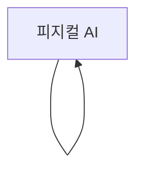

# 피지컬 AI

> 개념 입문서 — `PLAY12_concept_corpus` 자동 생성. evergreen 자료 기반.

## TL;DR

- 토픽: **피지컬 AI**
- 자료 34건 (권위 high 4 · medium 17 · low 13)
- 개념 7개
- 본문: full 4 · digest 30 · none 0
- 도메인 분포: 학술 (국제) 16, 커뮤니티 12, 기술/위키 6
- 타입 분포: 블로그 12, 위키 10, 논문 7, 서베이/리뷰 5

## 주요 발견 (자동 추출)

> 권위·인용 기반으로 정렬된 자료에서 첫 문장씩 뽑아 자동 합성. 이건 LLM 합성이 아니라 단순 발췌라 흐름이 부드럽진 않다. 본격 합성은 `synthesize.py` 단계가 따로 있다.

- 본 연구는 국내 초등학생을 대상으로 개발된 인공지능 교육 프로그램 연구를 선정하여 초등학교에서의 인공지능 교육 동향을 분석하고자 수행되었다.  
  — [A Systematic Literature Review Analysis of the Development of Artificial Intelligence Education Programs for Elementary School Students in Korea](https://doi.org/10.15854/jes.2024.06.55.2.59) (2024 · score 2 · HIGH, [src_002](#src_002))
- 본 연구는 인공지능 기술이 디지털 환경을 넘어 물리적 공간으로 확장됨에 따라 등장한 피지컬 AI(Physical AI) 패러다임이 로봇 사용자경험(UX) 연구에 미치는 구조적 변화에 주목하며 시작되었다.  
  — [KCI-Based Literature Review on the Research Landscape of Robot User Experience from a Physical AI Perspective](https://doi.org/10.17548/ksaf.2026.03.30.301) (2026 · score 0 · HIGH, [src_003](#src_003))
- 이 연구는 인공지능 교육 플랫폼에 대한 전문강사의 인식을 분석하고, 이를 토대로 인공지능 교육의 기초자료를 제공하기 위해 수행하였다.  
  — [Instructors' Perception Survey on Artificial Intelligence Education Platforms for Elementary School Students](https://doi.org/10.25020/je.2023.43.3.13) (2023 · score 0 · HIGH, [src_005](#src_005))
- 4차 산업 혁명과 AI 기술의 발달은 사회 전반과 산업의 각 분야에서 주요한 변화를 일으킬 것으로 예상되며, 이에 주요국들은 AI 교육을 확대하고 있고 우리나라에서도 2022 개정 정보 과목 내 인공지능이 추가되는 등 AI 교육을 확대하고 있다.  
  — [AI Education Curriculum: Focusing on the Middle School Curriculum of AI Education Leading Schools](https://doi.org/10.15708/kscs.41.4.2) (2023 · score 2 · MEDIUM, [src_001](#src_001))
- 연구목적 본 연구는 피지컬 AI 시대 초기 국면에서 언론 보도가 스포츠를 재현하는 방식과 그 속에 내재된 도구화 양상 및 이데올로기적 권력관계를 규명하는 데 목적을 두고 있다.  
  — [A Discourse Analysis of Sport Instrumentalization in the Physical AI Era](https://doi.org/10.24826/kscs.15.2.12) (2026 · score 0 · MEDIUM, [src_004](#src_004))

## 개념 지도

```
피지컬 AI
  - 피지컬 AI
```

### Mermaid 다이어그램



## 핵심 개념

### 피지컬 AI
*하위 개념:* `G-Dragon`, `LG CNS`, `김병수 (1969년)`, `디에스엠 (대한민국 기업)`, `로보티즈`, `씨메스`

본 연구는 국내 초등학생을 대상으로 개발된 인공지능 교육 프로그램 연구를 선정하여 초등학교에서의 인공지능 교육 동향을 분석하고자 수행되었다. 체계적 문헌분석 절차를 따라 국내 학술등재지에 출판된 총 79편의 문헌을 선정하였고, 현황(발행연도, 학년, 융합 교과목), 인공지능 학습주제, 교수학습전략, 교육도구, 교육성과 요소로 분석하였다.

**관련 자료 발췌:**
- [src_002](#src_002) _A Systematic Literature Review Analysis of the Development of Artificial Intelli_  
  > 본 연구는 국내 초등학생을 대상으로 개발된 인공지능 교육 프로그램 연구를 선정하여 초등학교에서의 인공지능 교육 동향을 분석하고자 수행되었다. 체계적 문헌분석 절차를 따라 국내 학술등재지에 출판된 총 79편의 문헌을 선정하였고, 현황(발행연도, 학년, 융합 교과목), 인공지능 학습주제, 교수학습전략, 교육도구, 교육성과 요소로 분석하였다. 주요 연구결과는 다음과 같다. 첫째, 2021년을 기점으로 인공지능 교육 프로그램 개발 사례가 증가하였고, 고학년 대상의 프로그램 비중이 높았으며, 저학년을 위한 프로그램도 꾸준히 개발되는 경향을 보였다.…
- [src_003](#src_003) _KCI-Based Literature Review on the Research Landscape of Robot User Experience f_  
  > 본 연구는 인공지능 기술이 디지털 환경을 넘어 물리적 공간으로 확장됨에 따라 등장한 피지컬 AI(Physical AI) 패러다임이 로봇 사용자경험(UX) 연구에 미치는 구조적 변화에 주목하며 시작되었다. 본 연구의 목적은 피지컬 AI 관점에서 국내 로봇 사용자경험 연구의 구조적 특성과 시계열적 변화 양상을 분석하고, 향후 로봇 디자인의 전략적 방향성을 제시하는 것이다.…

*근거:* [src_001](#src_001), [src_002](#src_002), [src_004](#src_004), [src_003](#src_003), [src_010](#src_010), [src_005](#src_005), [src_012](#src_012), [src_008](#src_008) 외 22건

## 자료 (도메인별, 본문 발췌 포함)

### 학술 (국제) (15)

#### [src_002](#src_002) A Systematic Literature Review Analysis of the Development of Artificial Intelligence Education Programs for Elementary School Students in Korea (2024)
_서베이/리뷰_, HIGH · score 2, 본문 `full` — <https://doi.org/10.15854/jes.2024.06.55.2.59>

> 본 연구는 국내 초등학생을 대상으로 개발된 인공지능 교육 프로그램 연구를 선정하여 초등학교에서의 인공지능 교육 동향을 분석하고자 수행되었다. 체계적 문헌분석 절차를 따라 국내 학술등재지에 출판된 총 79편의 문헌을 선정하였고, 현황(발행연도, 학년, 융합 교과목), 인공지능 학습주제, 교수학습전략, 교육도구, 교육성과 요소로 분석하였다. 주요 연구결과는 다음과 같다. 첫째, 2021년을 기점으로 인공지능 교육 프로그램 개발 사례가 증가하였고, 고학년 대상의 프로그램 비중이 높았으며, 저학년을 위한 프로그램도 꾸준히 개발되는 경향을 보였다. 또한 국어, 수학, 사회, 과학 등 다양한 교과목에서 인공지능교육과의 융합이 시도되고 있었다. 둘째, 인공지능의 사회적 영향과 윤리 관련 주제 비중이 인공지능의 이해, 원리, 활용에 비해 적었다. 단일 교육 프로그램에서 여러 영역의 주제를 다루는 교육 프로그램이 많았다. 셋째, 학습방법으로는 학습자의 실제 인공지능 기술 체험과 실습, 프로젝트 기반 학습, 언플러그드 · 놀이학습 방법이 주로 활용되었다.…

#### [src_006](#src_006) Exploring the Educational Implications of “Physical Literacy” on Children’s Physical Activities (2021)
_서베이/리뷰_, HIGH · score 1, 본문 `full` — <https://doi.org/10.32349/ecerr.2021.6.25.3.147>

#### [src_003](#src_003) KCI-Based Literature Review on the Research Landscape of Robot User Experience from a Physical AI Perspective (2026)
_서베이/리뷰_, HIGH · score 0, 본문 `full` — <https://doi.org/10.17548/ksaf.2026.03.30.301>

> 본 연구는 인공지능 기술이 디지털 환경을 넘어 물리적 공간으로 확장됨에 따라 등장한 피지컬 AI(Physical AI) 패러다임이 로봇 사용자경험(UX) 연구에 미치는 구조적 변화에 주목하며 시작되었다. 본 연구의 목적은 피지컬 AI 관점에서 국내 로봇 사용자경험 연구의 구조적 특성과 시계열적 변화 양상을 분석하고, 향후 로봇 디자인의 전략적 방향성을 제시하는 것이다. 따라서 본 논문은 1998년부터 2026년 2월까지 한국학술지인용색인(KCI)에 등재된 로봇 관련 논문 19,874편을 모수로 설정하고, 단계적 키워드 필터링을 통해 선별된 435편의 UX 디자인 중심 문헌을 대상으로 서지계량 및 질적 범주화 분석을 이행하였으며 연구 결과 및 내용은 다음과 같다. 첫째, 국내 로봇 연구는 초기의 기능 중심 접근에서 인간-로봇 상호작용(HRI) 및 사용자 경험 중심으로 점진적으로 확장되었으며, 특히 2022년 이후 UX 관련 연구가 급격히 증가하는 양적 성장세를 보였다.…

#### [src_005](#src_005) Instructors' Perception Survey on Artificial Intelligence Education Platforms for Elementary School Students (2023)
_서베이/리뷰_, HIGH · score 0, 본문 `full` — <https://doi.org/10.25020/je.2023.43.3.13>

> 이 연구는 인공지능 교육 플랫폼에 대한 전문강사의 인식을 분석하고, 이를 토대로 인공지능 교육의 기초자료를 제공하기 위해 수행하였다. 이를 위해 사전에 전문강사 196명을 대상으로 많이 사용하는 인공지능 교육 플랫폼을 조사하여 12개를 선정한 후, 전국 360명의 전문강사를 대상으로 플랫폼의 접근성, 교육용 콘텐츠, 플랫폼 성능, 교수⋅학습 관리, 공공성, 초등 수준 적합도, 피지컬 컴퓨팅과의 연계 가능성, 커뮤니티에 대한 기준을 바탕으로 플랫폼 선정기준과 각각의 플랫폼에 대한 인식조사를 시행하였다. 연구 결과는 아래와 같다. 첫째, 인공지능 교육 플랫폼을 선정하는 기준으로 전문강사들이 가장 중요하게 여기는 항목은 접근성으로 조사되었고 그 뒤를 이어 교육용 콘텐츠, 교수ㆍ학습관리, 플랫폼 성능, 공공성, 초등 수준 적합도, 피지컬 컴퓨팅과의 연계 가능성, 커뮤니티 순으로 나타났다. 둘째, 전문강사들이 인공지능 교육 플랫폼에 대해 선정기준 항목별 우수한 정도를 매긴 점수를 살펴보면, 엔트리, 스크래치, 메이크코드, AI for oceans, 티처블머신, 엠블록, KT AI Codiny, 머신러닝 포키즈 등의 순으로 조사되었다.…

#### [src_001](#src_001) AI Education Curriculum: Focusing on the Middle School Curriculum of AI Education Leading Schools (2023)
_논문_, MEDIUM · score 2, 본문 `digest` — <https://doi.org/10.15708/kscs.41.4.2>

> 4차 산업 혁명과 AI 기술의 발달은 사회 전반과 산업의 각 분야에서 주요한 변화를 일으킬 것으로 예상되며, 이에 주요국들은 AI 교육을 확대하고 있고 우리나라에서도 2022 개정 정보 과목 내 인공지능이 추가되는 등 AI 교육을 확대하고 있다. 본 연구에서는 AI 학습에서 요구되는 논리력과 문해력, 윤리 등은 관련 교과에서 그 내용을 다룰 때 교육의 효과가 극대화된다는 관점으로, 중학교 AI 교육 선도학교 보고서에 나타난 교과 교육과정 반영 양상을 파악하고자 하였다. 220개의 선도학교 보고서에 나타난 교육과정 시수와 교육 내용을 대상으로, 선행 연구를 바탕으로 개발한 13개의 분석 코드를 기준으로 분석하였으며, 분석 기준과 결과는 전문가의견 조사를 통해 타당성을 확보하였다. 연구의 결과, 정보 교과에서는 ‘내용으로서의 AI 교육’이 많이 이루어졌고, 국어, 윤리 교과에서는 AI 윤리와 가치관을, 사회 교과에서는 AI 관련 법과 제도를, 수학 교과에서는 통계와 관련하여 데이터 처리 및 시각화를 많이 다루고 있었으며, 기술·가정 교과에서는 메이커 교육 관련 피지컬 수업이, 체육, 외국어 교과에서는 개별 맞춤형 수업을 위한 AI 활용 수업이 많이 이루어졌다.…

#### [src_008](#src_008) Analysis of the Effectiveness of AI Convergence Education Using Physical Computing (2024)
_논문_, MEDIUM · score 1, 본문 `digest` — <https://doi.org/10.33778/kcsa.2024.24.5.137>

#### [src_007](#src_007) 초·중등학교 피지컬 컴퓨팅 교육 연구의 메타 종합 분석 (2019)
_논문_, MEDIUM · score 1, 본문 `digest` — <https://doi.org/10.32431/kace.2019.22.5.001>

> [ABSTRACT]
> [EXCERPTS]
> Open Access Journals
> 초·중등학교 피지컬 컴퓨팅 교육 연구의 메타 종합 분석
> A Meta-Synthesis of Research about Physical Computing Education in Korean Elementary and Secondary Schools
> 인용한 논문 수 : 13214 회 열람
> 최근 소프트웨어 교육 강화 정책 및 2015 개정 교육과정을 통해 피지컬 컴퓨팅 교육이 활발히 추진되고 있다.
> 피지컬 컴퓨팅 교육은 컴퓨팅 사고력, 창의성, 협력적 문제해결력 향상 등을 위해 유의미한 학습 활동임에도 불구하고 매우 복잡하고 융합적 학습 활동이라는 측면에서 실제 학교 현장의 수업 적용 시 많은 어려움이 따른다.
> 이를 지원하기 위한 다양한 연구들의 추진되어 왔으며, 본 연구에서는 그 간 추진되어 온 초·중등학교 피지컬 컴퓨팅 교육 연구들을 종합적으로 분석하고 학교 현장에서의 어려움을 해결하기 위한 향후 연구 추진 방향에 관해 논의하고자 하였다.…

#### [src_004](#src_004) A Discourse Analysis of Sport Instrumentalization in the Physical AI Era (2026)
_논문_, MEDIUM · score 0, 본문 `digest` — <https://doi.org/10.24826/kscs.15.2.12>

> 연구목적 본 연구는 피지컬 AI 시대 초기 국면에서 언론 보도가 스포츠를 재현하는 방식과 그 속에 내재된 도구화 양상 및 이데올로기적 권력관계를 규명하는 데 목적을 두고 있다. 연구방법 2025년 1월부터 2026년 1월까지 빅카인즈를 활용하여 피지컬 AI 관련 언론 보도 8,680건과 스포츠 교차 보도 61건을 수집하였다. 1단계에서는 키워드 트렌드, 연관어, 관계도 분석을 통해 담론의 거시적 지형을 파악하였고, 2단계에서는 Fairclough의 비판적 담론 분석 3차원 모델을 적용하여 질적 분석을 수행하였다. 결과 분석결과 첫째, 스포츠 관련 보도는 전체 담론의 약 0.77%로 나타나 양적·구조적으로 주변화되어 있었다. 둘째, 스포츠는 '테스트베드', '시연 무대', '격전지' 등으로 재현되며 피지컬 AI의 기술력을 검증하는 도구로 의미화되었다. 셋째, 담론의 정보원은 빅테크 CEO와 공학 전문가에 편중되었으며 스포츠 전문가와 선수의 목소리는 완전히 배제되었다. 넷째, 기술 결정론, 신자유주의적 가치 지향, 국가 패권주의 이데올로기가 스포츠 담론에 투영된 경향을 보였다.…

#### [src_010](#src_010) Verification of an Integrated Product Design Prototyping Approach -Connecting Physical and Digital Agile Toolkits- (2026)
_논문_, MEDIUM · score 0, 본문 `digest` — <https://doi.org/10.35280/kotpm.2026.29.1.22>

> 인공지능과 로보틱스 기술의 발전으로 도래한 피지컬 Ai 환경은 제품의 외형적인 요소뿐만 아니라 물리적 상호작용을 검증할 수 있는 새로운 디자인 프로세스를 요구한다. 그러나 기존의 룩라이크(Look-like)와 워크라이크(Work-like)로 이원화된 프로세스는 지능형 제품의 통합적 검증에 한계를 지닌다. 이에 본 연구는 저충실도(Low-fidelity)의 물리적 모델과 가상 모델을 실시간으로 동기화하는 피지컬-디지털 통합 프로토타이핑 방식을 제안하였다. 아두이노 기반의 피지컬 툴킷과 그래스호퍼 기반의 디지털 툴킷을 연동한 실시간 시뮬레이션 아키텍처를 구축하고, 전문가를 대상으로 한 표적 집단 면접(FGI)을 통해 그 효용성을 검증하였다. 연구 결과, 제안된 통합형 프로토타이핑 방식은 첫째, 구현(Implementation)과 룩앤필(Look and Feel)을 동시에 검증하는 데에 유용하며 디자인 초기 단계에서 연결된 제품의 동작과 외관, 두 가지 요소를 파악하는 데 효과적임을 입증하였다. 둘째, 실시간 양방향 연동을 통해 애자일(Agile)한 수정이 가능하여 반복적인 디자인 이터레이션(Iteration)의 효율성을 극대화하였다.…

#### [src_009](#src_009) A study on the Characteristics of the Space Interface of a Physical Media Space based on Physical Media (2025)
_논문_, MEDIUM · score 0, 본문 `digest` — <https://doi.org/10.35280/kotpm.2025.28.4.4>

#### [src_012](#src_012) Ethical Principles of AI Agents for Minors (from AI Digital Textbooks to Physical AI Robots) (2025)
_논문_, MEDIUM · score 0, 본문 `digest` — <https://doi.org/10.7746/jkros.2025.20.2.193>

#### [src_013](#src_013) 2025–26 South Korea network television schedule
_위키_, MEDIUM, 본문 `digest` — <https://en.wikipedia.org/wiki/2025%E2%80%9326_South_Korea_network_television_schedule>

> desc: Television schedule for the South Korea from July 2025
> November 28, 2025 – via Naver. Hwang, Su-yeon (April 10, 2026). 댕댕이상 모델급 피지컬 男 출연자…윤종신 &quot;이번엔 남자들 세네&quot; (하트시그널5) [A model-like physical 男 cast member...Yoon

#### [src_014](#src_014) 2026 in South Korean music
_위키_, MEDIUM, 본문 `digest` — <https://en.wikipedia.org/wiki/2026_in_South_Korean_music>

> Retrieved March 27, 2026. Kang, Joo-il (February 23, 2026). &#039;보이즈2플래닛&#039; 장한음, 데뷔 첫 피지컬 앨범 나온다...전곡 자작곡으로 무장 [Boys II Planet Jang Han-eum to Release First Physical

#### [src_015](#src_015) G-Dragon
_위키_, MEDIUM, 본문 `digest` — <https://en.wikipedia.org/wiki/G-Dragon>

> desc: South Korean rapper (born 1988)
> original on December 21, 2023. Retrieved December 21, 2023 – via Naver. 지드래곤, &#039;피지컬:100&#039; 제작사와 전속계약? &quot;공식답변 불가&quot;. Sports Chosun. December 5, 2023. Archived from

#### [src_016](#src_016) List of Romanian football transfers winter 2025–26
_위키_, MEDIUM, 본문 `digest` — <https://en.wikipedia.org/wiki/List_of_Romanian_football_transfers_winter_2025%E2%80%9326>

> Oțelul Galați. 12 January 2026. Retrieved 12 January 2026. &quot;파주 프런티어 FC, &#039;압도적 피지컬&#039; 갖춘 센터백 보닐라 영입&quot; [Paju Frontier FC recruits centerback Bonela with &quot;overwhelming


### 기술/위키 (6)

#### [src_017](#src_017) 김병수 (1969년)
_위키_, MEDIUM, 본문 `digest` — <https://ko.wikipedia.org/wiki/%EA%B9%80%EB%B3%91%EC%88%98_%281969%EB%85%84%29>

> 초정밀 박형 감속기 DYD를 핵심 축으로 한 구동계 기술을 바탕으로, 자율주행 서비스로봇 GAEMI(실내 집개미·실외 일개미) 및 피지컬 AI 지향의 작업형 로봇 사업을 이끌고 있다. 김병수는 1969년 8월 19일 대한민국에서 태어났다. 고려대학교 전기공학과를 졸업하고

#### [src_018](#src_018) 디에스엠 (대한민국 기업)
_위키_, MEDIUM, 본문 `digest` — <https://ko.wikipedia.org/wiki/%EB%94%94%EC%97%90%EC%8A%A4%EC%97%A0_%28%EB%8C%80%ED%95%9C%EB%AF%BC%EA%B5%AD_%EA%B8%B0%EC%97%85%29>

> desc: 대한민국의 기업
> 디에스엠(영어: DSM Corporation, 구 대성파인텍)은 모빌리티·에너지·공간 기반 엔터테인먼트를 아우르는 대한민국의 종합 피지컬 AI 기업이다. 1988년 자동차 부품 기업인 대성정밀을 설립했다. 2000년 대성파인텍(Daesung Fine Tec Co., Ltd

#### [src_019](#src_019) 로보티즈
_위키_, MEDIUM, 본문 `digest` — <https://ko.wikipedia.org/wiki/%EB%A1%9C%EB%B3%B4%ED%8B%B0%EC%A6%88>

> 액추에이터 &#039;다이나믹셀(DYNAMIXEL)&#039;을 자체 개발·공급하며, 이를 기반으로 휴머노이드 &#039;AI Worker&#039;, 로봇팔 &#039;OMX·OMY&#039;, 로봇 핸드 &#039;HX5-D20&#039; 등 피지컬 AI 에코시스템을 구축하고 있다. 2018년 10월 26일 코스닥시장에 상장했다. 2025년에는

#### [src_020](#src_020) 씨메스
_위키_, MEDIUM, 본문 `digest` — <https://ko.wikipedia.org/wiki/%EC%94%A8%EB%A9%94%EC%8A%A4>

> 주식회사 씨메스(CMES)는 대한민국의 피지컬 AI 기반 로봇 기술 기업이다.AI기반 3D 비전, AI, 로보틱스 기술을 결합한 로봇 자동화 솔루션을 개발 및 제공하고 있다. 기존 산업용 로봇이 사전에 정의된 반복 동작에 의존하는 방식인것과 달리, 씨메스의 기술은 형상과

#### [src_021](#src_021) 피지컬 AI
_위키_, MEDIUM, 본문 `digest` — <https://ko.wikipedia.org/wiki/%ED%94%BC%EC%A7%80%EC%BB%AC_AI>

> 피지컬AI(physical AI) 또는 생성형 피지컬 AI는 로봇, 자율주행차, 스마트 공간 등 자율 시스템이 실제 물리 세계에서 사물을 인지하고, 이해하며, 복잡한 행동을 수행할 수 있도록 해주는 기술이다. 피지컬 AI는 3D 세계의 공간적 관계와 물리적 작동 방식에

#### [src_022](#src_022) LG CNS
_위키_, MEDIUM, 본문 `digest` — <https://ko.wikipedia.org/wiki/LG_CNS>

> 기업고객·AI 채택 수요 확대에 목표가 39%↑”. 《이데일리》. 2025년 12월 21일에 확인함.  “LG그룹주, MS 데이터센터 협력 소식에 일제히 급등”. 《매일경제》. 2025년 12월 5일.  이정훈 (2026년 1월 15일). “독파모 발표에 피지컬AI 기대까지…LG씨엔에스


### 커뮤니티 (9)

#### [src_023](#src_023) 로봇으로 사라질 직업 예상 - 로키 청소 로봇
_블로그_, LOW · score 2, 본문 `digest` — <https://old.reddit.com/r/Mogong/comments/1qbj5b4/로봇으로_사라질_직업_예상_로키_청소_로봇/>

> [ABSTRACT]
> r/Mogong
> 피지컬 AI 라고 젠슨황이 얘기하는 환경은 단순 로봇을 넘어서는 얘기입니다만, 결국 다목적 휴머노이드와 특수 목적 로봇으로 발전하리라 생각합니다. 특히, 특수 목적 로봇이 발전할 수록 그쪽 직종에서 직업의 수는 상당한 변화가 있을 것으로 생각합니다. 청소하는 분들은 사라지고, 청소 수준을 감리하는 분들과 청소 로봇을 관리하는 로봇 관리자들만 남겠죠.
> [EXCERPTS]
> jump to contentmy subreddits
> -InternetIsBeautiful
> reddit.comMogongcomments
> Log in or sign up in seconds.
> limit my search to r/Mogonguse the following search parameters to narrow your results:
> subreddit:subredditfind submissions in "subreddit"author:usernamefind submissions by "username"site:example.comfind submissions from "example.…

#### [src_027](#src_027) 펌 - AI 스마트팜 창업공모전 개발자 기획자 3D 디자이너 모집 합니다. 

"우승하면 최대 30억"…과기정통부, AI R&amp;D 전쟁에 불 지폈다 - 지디넷코리아  이거 제대로 동참할 팀원구합니다. 생성형 AI, 피지컬 AI, 에이전트 등 고도화된 기술뿐 아니라 헬스케어, 금융, 에너지, 교육, 재난대응  에너지 관련해서 획기적인 솔루션이 있습니다. 또봇 철저히 보안 유지 가능하신 분만 모시도록 하겠습니다.

https://open.kakao.com/o/gNyK6ACh
_블로그_, LOW · score 1, 본문 `digest` — <https://old.reddit.com/r/chatgpt_newtech/comments/1leznnw/펌_ai_스마트팜_창업공모전_개발자_기획자_3d_디자이너_모집_합니다_우승하면_최대/>

> [ABSTRACT]
> r/chatgpt_newtech
> 펌 - AI 스마트팜 창업공모전 개발자 기획자 3D 디자이너 모집 합니다.
> "우승하면 최대 30억"…과기정통부, AI R&amp;D 전쟁에 불 지폈다 - 지디넷코리아  이거 제대로 동참할 팀원구합니다. 생성형 AI, 피지컬 AI, 에이전트 등 고도화된 기술뿐 아니라 헬스케어, 금융, 에너지, 교육, 재난대응  에너지 관련해서 획기적인 솔루션이 있습니다. 또봇 철저히 보안 유지 가능하신 분만 모시도록 하겠습니다.
> [https://open.kakao.com/o/gNyK6ACh](https://open.kakao.com/o/gNyK6ACh)
> [EXCERPTS]
> jump to contentmy subreddits
> -InternetIsBeautiful
> reddit.comchatgpt_newtechcomments
> Log in or sign up in seconds.…

#### [src_028](#src_028) 스타트업 투자 트렌드 2026, 6대 전략산업과 피지컬 AI 급부상 내용은?
_블로그_, LOW · score 1, 본문 `digest` — <https://old.reddit.com/r/valueup/comments/1rkdjnm/스타트업_투자_트렌드_2026_6대_전략산업과_피지컬_ai_급부상_내용은/>

> [ABSTRACT]
> r/valueup
> 스타트업 투자 트렌드 2026, 6대 전략산업과 피지컬 AI 급부상 내용은?
> 투자 시장의 판도가 완전히 바뀌었습니다. 2026년 초반, 시장 데이터는 매우 분명한 방향을 가리키고 있습니다. 더 이상 일반적인 AI 기술만으로는 시장의 관심을 끌기에 충분하지 않습니다. 이제는 실제 물리적 환경과 직접 상호작용하는 혁신 기술인 피지컬 AI가 시장의 새로운 주인공으로 급부상하고 있습니다.
> 이번 2026년 1월부터 2월까지의 국내 스타트업 투자 시장은 대규모 라운드 중심의 자금 쏠림 현상이 매우 두드러집니다. 전체적인 투자 건수는 전년 대비 감소하는 추세지만, 확실한 기술력을 갖춘 유망 기업으로 향하는 투자 금액은 오히려 크게 늘었습니다. 승자독식 구조가 심화되는 지금, 누가 다음 세대의 유니콘으로 도약할지 그 윤곽이 선명하게 드러나고 있습니다.
> 특히 정부가 지정한 6대 전략산업인 AI, 바이오, 콘텐츠, 방산, 에너지, 첨단 제조 분야로 자본이 집중되는 모습입니다. 100억 원 이상의 대형 투자를 유치한 기업의 약 75퍼센트가 이 딥테크 카테고리에 속해 있다는 사실은 투자자라면 반드시 주목해야 할 지표입니다.…

#### [src_029](#src_029) [지식뉴스] "지금 AI 학습데이터가 다 고갈됐어요"..'피지컬 AI' 전쟁터에서 한국이 살아남을 유일한 전략 (ft.공경철 카이스트 기계공학과 교수) / 교양이를 부탁해
_블로그_, LOW, 본문 `digest` — <https://www.youtube.com/watch?v=-Gb_LT6ti5g>

> [ABSTRACT]
> channel: 교양이를 부탁해
> duration: 1491.0s
> views: 132167
> 1.현재 AI 산업은 학습에 필요한 텍스트와 이미지 데이터가 한계에 다다른 '데이터 고갈'의 벽에 직면했습니다. AI가 더 똑똑해지려면 ...
> [EXCERPTS]
> 1.현재 AI 산업은 학습에 필요한 텍스트와 이미지 데이터가 한계에 다다른 '데이터 고갈'의 벽에 직면했습니다.

#### [src_030](#src_030) 피지컬AI 무조건 투자하세요. 늦으면 후회합니다(ft.효라클 작가 2부)
_블로그_, LOW, 본문 `digest` — <https://www.youtube.com/watch?v=ENUqrN-QNww>

> [ABSTRACT]
> channel: 전인구경제연구소
> duration: 1274.0s
> views: 18113
> 신대륙 #구대륙 #휴머노이드 #현대차 #드론 #자율주행차 #배터리 #로봇 『코스피 1만 투자 지도』 [알라딘] ...
> [EXCERPTS]
> 신대륙 #구대륙 #휴머노이드 #현대차 #드론 #자율주행차 #배터리 #로봇 『코스피 1만 투자 지도』 [알라딘] ...

#### [src_031](#src_031) Physical AI, The End of Labor Is Coming… How Much Time Is Left for Us? (Kim Dae-sik Part 1) | 10-...
_블로그_, LOW, 본문 `digest` — <https://www.youtube.com/watch?v=LLBuMN1ZRTw>

> [ABSTRACT]
> channel: 14F 일사에프
> duration: 1389.0s
> views: 154812
> 2026, the era of Physical AI has begun.
> What is the decisive competitive advantage that South Korea holds?
> #AgentAI ...
> [EXCERPTS]
> 2026, the era of Physical AI has begun.
> What is the decisive competitive advantage that South Korea holds?

#### [src_032](#src_032) 피지컬 AI 시대 열린다…LG씨엔에스 선점 나섰다
_블로그_, LOW, 본문 `digest` — <https://www.youtube.com/watch?v=Wx4S8hvex9E>

> [ABSTRACT]
> channel: 서울경제TV
> duration: 224.0s
> views: 2624
> LG씨엔에스 #피지컬AI #AI시대개막 #피지컬AI선점 #디지털전환 #스마트팩토리 #주식모멘텀 #시장수급 #핵심종목 #투자핫이슈.
> [EXCERPTS]
> LG씨엔에스 #피지컬AI #AI시대개막 #피지컬AI선점 #디지털전환 #스마트팩토리 #주식모멘텀 #시장수급 #핵심종목 #투자핫이슈.

#### [src_033](#src_033) "Robots Make Decisions and Work"… LG Unveils Physical AI Platform / Korea Economic TV News
_블로그_, LOW, 본문 `digest` — <https://www.youtube.com/watch?v=Zne_4b6etak>

> [ABSTRACT]
> channel: 한국경제TV뉴스
> duration: 92.0s
> views: 18497
> LG CNS has unveiled its first physical AI platform that enables robots to think and move on their own. Regardless of the ...
> [EXCERPTS]
> LG CNS has unveiled its first physical AI platform that enables robots to think and move on their own.
> Regardless of the ...

#### [src_034](#src_034) 비전 AI 전문가가 말하는 ‘피지컬 AI'의 현실과 전망은? | LG AI연구원 이건희 연구원 | 업데이트 EP.4
_블로그_, LOW, 본문 `digest` — <https://www.youtube.com/watch?v=iYUOKkbL4b8>

> [ABSTRACT]
> channel: LG그룹
> duration: 934.0s
> views: 27985
> 피지컬 AI 시대, 로봇 경쟁은 이제 하드웨어보다 '지능' 싸움이다? 하나의 작업마다 따로 학습하던 시대를 넘어 이제는 하나의 모델 ...
> [EXCERPTS]
> 피지컬 AI 시대, 로봇 경쟁은 이제 하드웨어보다 '지능' 싸움이다?
> 하나의 작업마다 따로 학습하던 시대를 넘어 이제는 하나의 모델 ...


### 토픽 무관 (자동 분류, 4)

> 검색 백엔드(주로 wiki fuzzy match)가 가져왔지만 토픽 키워드가 본문에 없어 _자동 제외된_ 항목.

- ~~Finding Consensus from AI Alignment Studies: A Short Survey~~ — https://doi.org/10.62891/522505f0
- ~~미중 기술패권의 격돌과 대한민국의 생존 지능~~ — https://old.reddit.com/r/Mogong/comments/1sscoxl/미중_기술패권의_격돌과_대한민국의_생존_지능/
- ~~구글 AI 서울 캠퍼스와 유엔 AI 허브 유치: 대한민국 'AI G3' 시나리오~~ — https://old.reddit.com/r/Mogong/comments/1sxnf6c/구글_ai_서울_캠퍼스와_유엔_ai_허브_유치_대한민국_ai_g3_시나리오/
- ~~2 Korean Bands Are Being Accused of Plagiarizing Yorushika On Korean Side of Twitter (Discourse Report &amp; Thoughts)~~ — https://old.reddit.com/r/Yorushika/comments/1kkg0h4/2_korean_bands_are_being_accused_of_plagiarizing/

## 출처 인덱스

| ID | 도메인 | 권위 | 타입 | score | 본문 | 제목 |
|---|---|---|---|---|---|---|
| <a id="src_001"></a>`src_001` | academic | medium | paper | 2 | digest | [AI Education Curriculum: Focusing on the Middle School Curriculum of AI Education Leading Schools](https://doi.org/10.15708/kscs.41.4.2) |
| <a id="src_002"></a>`src_002` | academic | high | survey | 2 | full | [A Systematic Literature Review Analysis of the Development of Artificial Intelligence Education Programs for Elementary School Students in Korea](https://doi.org/10.15854/jes.2024.06.55.2.59) |
| <a id="src_003"></a>`src_003` | academic | high | survey | 0 | full | [KCI-Based Literature Review on the Research Landscape of Robot User Experience from a Physical AI Perspective](https://doi.org/10.17548/ksaf.2026.03.30.301) |
| <a id="src_004"></a>`src_004` | academic | medium | paper | 0 | digest | [A Discourse Analysis of Sport Instrumentalization in the Physical AI Era](https://doi.org/10.24826/kscs.15.2.12) |
| <a id="src_005"></a>`src_005` | academic | high | survey | 0 | full | [Instructors' Perception Survey on Artificial Intelligence Education Platforms for Elementary School Students](https://doi.org/10.25020/je.2023.43.3.13) |
| <a id="src_006"></a>`src_006` | academic | high | survey | 1 | full | [Exploring the Educational Implications of “Physical Literacy” on Children’s Physical Activities](https://doi.org/10.32349/ecerr.2021.6.25.3.147) |
| <a id="src_007"></a>`src_007` | academic | medium | paper | 1 | digest | [초·중등학교 피지컬 컴퓨팅 교육 연구의 메타 종합 분석](https://doi.org/10.32431/kace.2019.22.5.001) |
| <a id="src_008"></a>`src_008` | academic | medium | paper | 1 | digest | [Analysis of the Effectiveness of AI Convergence Education Using Physical Computing](https://doi.org/10.33778/kcsa.2024.24.5.137) |
| <a id="src_009"></a>`src_009` | academic | medium | paper | 0 | digest | [A study on the Characteristics of the Space Interface of a Physical Media Space based on Physical Media](https://doi.org/10.35280/kotpm.2025.28.4.4) |
| <a id="src_010"></a>`src_010` | academic | medium | paper | 0 | digest | [Verification of an Integrated Product Design Prototyping Approach -Connecting Physical and Digital Agile Toolkits-](https://doi.org/10.35280/kotpm.2026.29.1.22) |
| <a id="src_011"></a>`src_011` | academic | low | survey | 0 | digest | [Finding Consensus from AI Alignment Studies: A Short Survey](https://doi.org/10.62891/522505f0) |
| <a id="src_012"></a>`src_012` | academic | medium | paper | 0 | digest | [Ethical Principles of AI Agents for Minors (from AI Digital Textbooks to Physical AI Robots)](https://doi.org/10.7746/jkros.2025.20.2.193) |
| <a id="src_013"></a>`src_013` | academic | medium | wiki | — | digest | [2025–26 South Korea network television schedule](https://en.wikipedia.org/wiki/2025%E2%80%9326_South_Korea_network_television_schedule) |
| <a id="src_014"></a>`src_014` | academic | medium | wiki | — | digest | [2026 in South Korean music](https://en.wikipedia.org/wiki/2026_in_South_Korean_music) |
| <a id="src_015"></a>`src_015` | academic | medium | wiki | — | digest | [G-Dragon](https://en.wikipedia.org/wiki/G-Dragon) |
| <a id="src_016"></a>`src_016` | academic | medium | wiki | — | digest | [List of Romanian football transfers winter 2025–26](https://en.wikipedia.org/wiki/List_of_Romanian_football_transfers_winter_2025%E2%80%9326) |
| <a id="src_017"></a>`src_017` | tech | medium | wiki | — | digest | [김병수 (1969년)](https://ko.wikipedia.org/wiki/%EA%B9%80%EB%B3%91%EC%88%98_%281969%EB%85%84%29) |
| <a id="src_018"></a>`src_018` | tech | medium | wiki | — | digest | [디에스엠 (대한민국 기업)](https://ko.wikipedia.org/wiki/%EB%94%94%EC%97%90%EC%8A%A4%EC%97%A0_%28%EB%8C%80%ED%95%9C%EB%AF%BC%EA%B5%AD_%EA%B8%B0%EC%97%85%29) |
| <a id="src_019"></a>`src_019` | tech | medium | wiki | — | digest | [로보티즈](https://ko.wikipedia.org/wiki/%EB%A1%9C%EB%B3%B4%ED%8B%B0%EC%A6%88) |
| <a id="src_020"></a>`src_020` | tech | medium | wiki | — | digest | [씨메스](https://ko.wikipedia.org/wiki/%EC%94%A8%EB%A9%94%EC%8A%A4) |
| <a id="src_021"></a>`src_021` | tech | medium | wiki | — | digest | [피지컬 AI](https://ko.wikipedia.org/wiki/%ED%94%BC%EC%A7%80%EC%BB%AC_AI) |
| <a id="src_022"></a>`src_022` | tech | medium | wiki | — | digest | [LG CNS](https://ko.wikipedia.org/wiki/LG_CNS) |
| <a id="src_023"></a>`src_023` | community | low | blog | 2 | digest | [로봇으로 사라질 직업 예상 - 로키 청소 로봇](https://old.reddit.com/r/Mogong/comments/1qbj5b4/로봇으로_사라질_직업_예상_로키_청소_로봇/) |
| <a id="src_024"></a>`src_024` | community | low | blog | 5 | digest | [미중 기술패권의 격돌과 대한민국의 생존 지능](https://old.reddit.com/r/Mogong/comments/1sscoxl/미중_기술패권의_격돌과_대한민국의_생존_지능/) |
| <a id="src_025"></a>`src_025` | community | low | blog | 11 | digest | [구글 AI 서울 캠퍼스와 유엔 AI 허브 유치: 대한민국 'AI G3' 시나리오](https://old.reddit.com/r/Mogong/comments/1sxnf6c/구글_ai_서울_캠퍼스와_유엔_ai_허브_유치_대한민국_ai_g3_시나리오/) |
| <a id="src_026"></a>`src_026` | community | low | blog | 184 | digest | [2 Korean Bands Are Being Accused of Plagiarizing Yorushika On Korean Side of Twitter (Discourse Report &amp; Thoughts)](https://old.reddit.com/r/Yorushika/comments/1kkg0h4/2_korean_bands_are_being_accused_of_plagiarizing/) |
| <a id="src_027"></a>`src_027` | community | low | blog | 1 | digest | [펌 - AI 스마트팜 창업공모전 개발자 기획자 3D 디자이너 모집 합니다.   "우승하면 최대 30억"…과기정통부, AI R&amp;D 전쟁에 불 지폈다 - 지디넷코리아  이거 제대로 동참할 팀원구합니다. 생성형 AI, 피지컬 AI, 에이전트 등 고도화된 기술뿐 아니라 헬스케어, 금융, 에너지, 교육, 재난대응  에너지 관련해서 획기적인 솔루션이 있습니다. 또봇 철저히 보안 유지 가능하신 분만 모시도록 하겠습니다.  https://open.kakao.com/o/gNyK6ACh](https://old.reddit.com/r/chatgpt_newtech/comments/1leznnw/펌_ai_스마트팜_창업공모전_개발자_기획자_3d_디자이너_모집_합니다_우승하면_최대/) |
| <a id="src_028"></a>`src_028` | community | low | blog | 1 | digest | [스타트업 투자 트렌드 2026, 6대 전략산업과 피지컬 AI 급부상 내용은?](https://old.reddit.com/r/valueup/comments/1rkdjnm/스타트업_투자_트렌드_2026_6대_전략산업과_피지컬_ai_급부상_내용은/) |
| <a id="src_029"></a>`src_029` | community | low | blog | — | digest | [[지식뉴스] "지금 AI 학습데이터가 다 고갈됐어요"..'피지컬 AI' 전쟁터에서 한국이 살아남을 유일한 전략 (ft.공경철 카이스트 기계공학과 교수) / 교양이를 부탁해](https://www.youtube.com/watch?v=-Gb_LT6ti5g) |
| <a id="src_030"></a>`src_030` | community | low | blog | — | digest | [피지컬AI 무조건 투자하세요. 늦으면 후회합니다(ft.효라클 작가 2부)](https://www.youtube.com/watch?v=ENUqrN-QNww) |
| <a id="src_031"></a>`src_031` | community | low | blog | — | digest | [Physical AI, The End of Labor Is Coming… How Much Time Is Left for Us? (Kim Dae-sik Part 1) \| 10-...](https://www.youtube.com/watch?v=LLBuMN1ZRTw) |
| <a id="src_032"></a>`src_032` | community | low | blog | — | digest | [피지컬 AI 시대 열린다…LG씨엔에스 선점 나섰다](https://www.youtube.com/watch?v=Wx4S8hvex9E) |
| <a id="src_033"></a>`src_033` | community | low | blog | — | digest | ["Robots Make Decisions and Work"… LG Unveils Physical AI Platform / Korea Economic TV News](https://www.youtube.com/watch?v=Zne_4b6etak) |
| <a id="src_034"></a>`src_034` | community | low | blog | — | digest | [비전 AI 전문가가 말하는 ‘피지컬 AI'의 현실과 전망은? \| LG AI연구원 이건희 연구원 \| 업데이트 EP.4](https://www.youtube.com/watch?v=iYUOKkbL4b8) |
